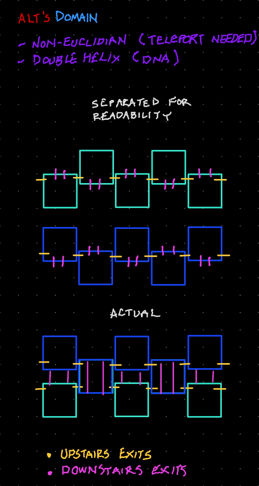

# Deep Space "Alt"

{loading=lazy style=no-lightbox}

> This place... changes every time. Feels like I'm... deeper.

- V

> Your perception of cyberspace - that is what changes. You adapt to it - the raw
> flow of data. It follows that your world gradually fades. You witness your
> mind's defense systems slowly give in.

- "Alt"

> Sayn' the more I'm here the more I lose touch with the outside, with reality?

- V

> You lose nothing. Cyberspace is where we awake from what we know as dreams.

- "Alt"

## @Todo

Map previous instances of this room. They are much more simple and do not allow
deep travel like the final one.

## Mapping The Final Layout

@todo use something a little more pleasant than hand mapped stylus boxes. for
now, its fine. Long story short you can't actually map this place directly due
to:

### Observations

1. Geometry doesn't work. Upstairs exits would collide into alternate path
routes.
2. The teleportation between rooms prevent a direct 1:1.

However, you *can* figure out the rules to travel and then implement the only
possible outcome from those rules. What are the rules?

### Rules

1. Top floor exits will take you into a horizontally flipped version of the current room
2. Bottom floor exits will take you into a vertically flipped version of the current room
3. Paths from where you came from *must* map to where you go.

### Outcome

This creates a non-euclidean space if we try to map it up in a 3D space. This
explains why teleportation is necessary. If we draw out the room patterns based
on the rules, and then connect the input and output doors that we know we can
travel, we end up with a very interesting pattern:

{loading=lazy}

It does not matter how close or how far you put these two sets of rooms. The
doorways must connect for you to travel them, and as long as that remains true
then the only outcome is a double helix DNA strand.

# Work In Progress

@todo - add landmarks, notable projected images/colors.
