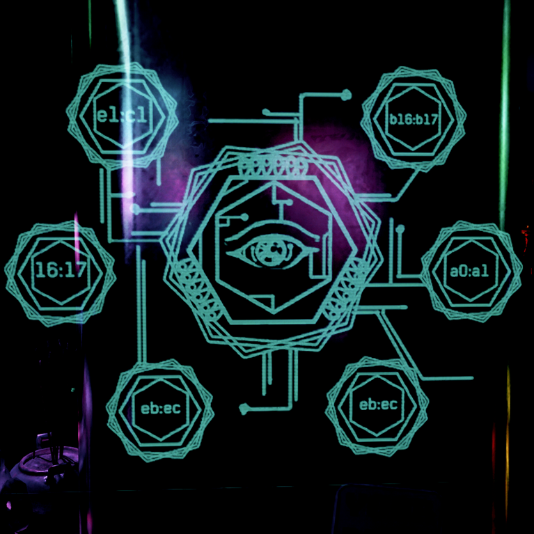

# Chakra Harmonization

{class=no-lightbox}

## About

Inside of Misty's Esoterica, there exists a single chart of major interest and
historical research. There have been many interpretations of this chart. From
time codes into the stars.

## My Interpretation

Originally posted in 2023, my interpretation was seen as a bit too out there at
the time. Now with the spinning cube, this interpretation seems more relevant
than ever.

At the center, you see an eye looking from behind, back at the player through a
6 sided shape. Just outside of this shape is two overlapping 6 sided shapes,
each rotated from the original by a number of degrees. They have 18 total
points inside of them (6 along 3 edges).

The circuitboard traces coming off of the shapes go in both directions,
indicating a clockwise and counter-clockwise flow.

## Making The Contraption

At the onset, this symbolism held no meaning. It was just a bunch of jumbled
data. Data, however, comes from somewhere. Where? Could I build something that
could express this data in a way that makes sense?

It turns out I could.

If we treat the numbers and letters as grid markers pointing to spaces along
the central shape, separated by degrees of rotation, and consider the ability
to see it from behind, one kind of tool makes sense. A 3 dimensional grid. A
proper 3 dimensional grid that points in every direction could express rotations,
flips, and mirrors in a way that point locality is not lost in the transition:

<video controls width="640" height="360">
  <source src="/Research/Around%20The%20City/assets/chakra.webm" type="video/webm">
  Your browser does not support the video tag.
</video>

In this demonstration, you can see that no matter how we flip or rotate the 3
dimensional shape, the points on the graph always align to the labels on the
chart. A 3D cube.
