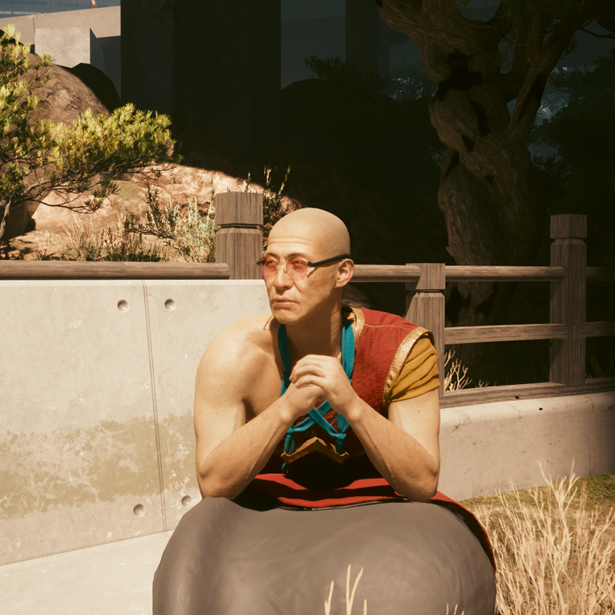
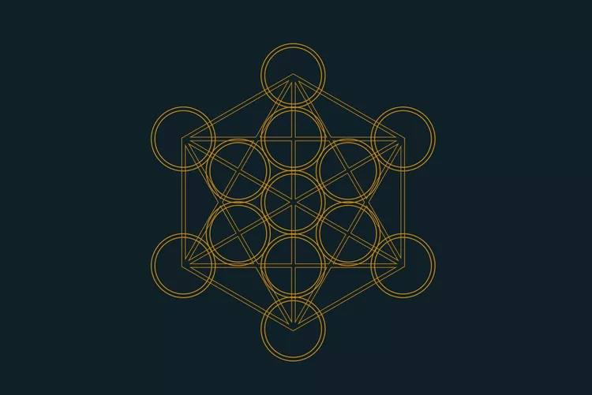
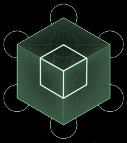
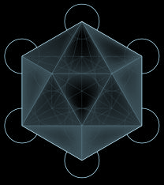
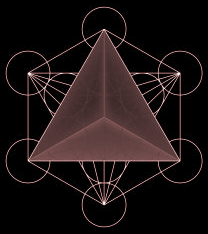
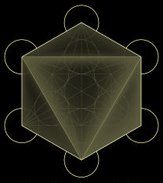
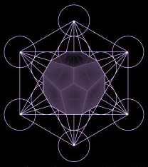

# Everything Zen

{class=no-lightbox}

## Foreword

The Zen Master uses teachings from the elements of sacred geometry in his
quest chain. He claims that we have no strong roots in this world and that we
are losing touch of ourself. We take him up on his offer to help us purify
ourselves.

Fire, earth, air, and water comprise his lesson plan. However, there's a fifth
lesson that goes unmentioned.

## What Is Sacred Geometry?

> Symbols are more resilient than you think.

- Hanako Arasaka

Sacred geometry is a particular form of geometry that is believed to have
spiritual significance. It is often used in religious and spiritual contexts to
represent the fundamental patterns of the universe. The lowest
commondenominator of sacred geometry is the circle, which is a symbol of unity
and wholeness. From the circle, more complex shapes can be derived, such as the
Flower of Life and Metatron's Cube.

### The Metatron Cube

{class=no-lightbox}

This is a geometric figure that is said to represent the structure of the
universe. It holds within it the 5 Platonic Solids:

- Tetrahedron (Fire) - 4 equilateral triangles
- Cube (Earth) - 6 squares
- Octahedron (Air) - 8 equilateral triangles
- Dodecahedron (Ether/Spirit) - 12 pentagons
- Icosahedron (Water) - 20 equilateral triangles

The Zen Master teaches these lessons out of order, omitting the Dodecahedron
completely.

## Imagine (Earth)

  <iframe style="width:100%; aspect-ratio:16/9;" src="https://www.youtube.com/embed/RQOTeQ7jbLg?si=6dOfz27SWDDlq8mT" frameborder="0" allowfullscreen></iframe>

- Location: Corpo Plaza Park
- Optional Cost: `144` Eddies.
- Cube comprised of 6 squares.

{class=no-lightbox}

Stable and grounded with its flat square faces.

## Stairway To Heaven (Water)

  <iframe style="width:100%; aspect-ratio:16/9;" src="https://www.youtube.com/embed/7dsxXWYUeRg?si=KfTsY_q9nYrvCEbI" frameborder="0" allowfullscreen></iframe>

- Location: Japantown
- Optional Cost: `233` Eddies.

{class=no-lightbox}

Fluid and adaptable with its 20 triangular faces.

## Poem of the Atoms (Fire)

  <iframe style="width:100%; aspect-ratio:16/9;" src="https://www.youtube.com/embed/VOyvo10hlKs?si=Llkfep8cFA6GezDs" frameborder="0" allowfullscreen></iframe>

- Location: North Oak Roundabout
- Optional Cost: `377` Eddies.

{class=no-lightbox}

Sharp pionts and edges symbolizing the heat of fire with its 4 triangular faces.

## Meetings Along the Edge (Air)

  <iframe style="width:100%; aspect-ratio:16/9;" src="https://www.youtube.com/embed/Vb9twVBTppc?si=dCntDqXbqidluxRK" frameborder="0" allowfullscreen></iframe>

- Location: Cliff Overlooking the Solar Array.
- Optional Cost: `610` Eddies.

{class=no-lightbox}

Airly lightness, as its 8 small triangles could be thought to drift like air.

From this meditation, you will receive two shards and an altar apartment
decoration. These shards are [Beelzebub's Tales To His Grandson](https://cyberpunk.fandom.com/wiki/Beelzebub%27s_Tales_to_His_Grandson) and [Teachings
Of The Temple](https://cyberpunk.fandom.com/wiki/Teachings_of_the_Temple_-_Excerpts).

## The Fifth Element (Ether/Spirit)

The astute among players probably noticed that the price you can pay to the Zen
Master increases with each meditation along the numbers of the Fibonacci
sequence. In the spirit of sequencing, lets take a look at the fifth element
now, spirit.

- Location: Unknown
- Optional Cost: `987` Eddies.

{class=no-lightbox}

> The god used it for arranging the constellations on the whole
> heaven
>
> - Plato

Plato associated this 12-faced polyhedron with the heavens and the divine.
Later, Aristotle labeled this _aether_, the divine substance of the heavens. It
often symbolizes interconnectedness of all things.

## Some Thoughts

The order of the shapes if corrected whould be:

1. Tetrahedron (Fire) - 4 triangles - costs `377` Eddies
2. Cube (Earth) - 6 squares - costs `144` Eddies
3. Octahedron (Air) - 8 triangles - costs `610` Eddies
4. **Missing** Dodecahedron (Ether/Spirit) - 12 pentagons - costs `987` Eddies
5. Icosahedron (Water) - 20 triangles - costs `233` Eddies

The Zen Master teaches the lessons out of order, omitting the Dodecahedron:

1. Cube (Earth) - 6 squares - costs `144` Eddies
2. Icosahedron (Water) - 20 triangles - costs `233` Eddies
3. Tetrahedron (Fire) - 4 triangles - costs `377` Eddies
4. Octahedron (Air) - 8 triangles - costs `610` Eddies
5. Dodecahedron (Ether/Spirit) - 12 pentagons - costs `987` Eddies

To me, this symbolizes an assymetry or corruption in the world itself. Some
things are out of order while other things are missing. [Could this be pointing
at the game loop not being as sequential and complete as we
thought](time-as-a-loop.md#game-time-loop)?
