# Ghost Tunnel

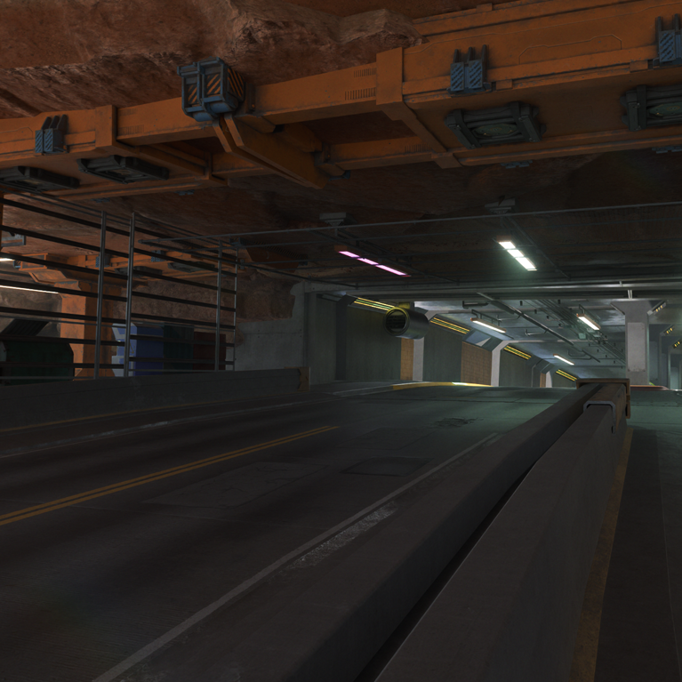{class=no-lightbox}

## About

There exists a hidden color that we can't see on the world map. This one hidden
color unravels an entire layer to what it is we're looking at when we play the
game.

## Prerequisite Knowledge

This line of research requires bits and pieces from my other research:

- [Color Research 1](theory-color-1.md)/[Color Research 2](theory-color-2.md)
- [Johnny as the World](theory-dreamscape.md)
- [Burning Man](research-burningman.md)

## Location

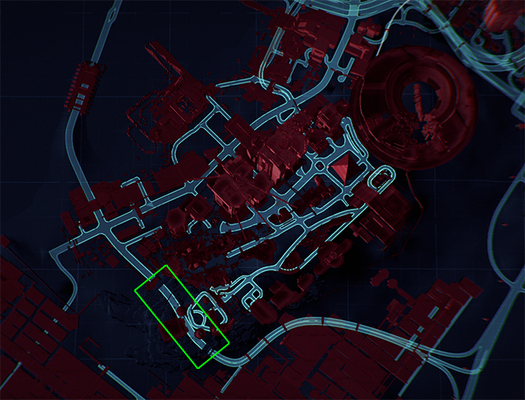{class=no-lightbox}

Ghost Tunnel is located just south of Dogtown. On the side of this tunnel is an
NCPD scanner activity with a group that believes a militech bunker rests
beyond. The tunnel is capped on both sides by an exposed red flow under the
right conditions.

## How I Discovered It

When considering that the statue used to show `FF:06:B5` in red text, that was
later changed to yellow, I was thinking at a very surface level. Why does it
say magenta but it is viewed as yellow? A confusing thing, like writing the
word blue out in red ink. This made me wonder - maybe we can't see magenta and
yet it's there? If that is the case then what would that mean?

Our overworld map view is _almost red_, cyan and blue. It isn't deep true red.
So I drew up an additive color chart to see if looking through magenta would
hide anything (I only made magenta additive here):

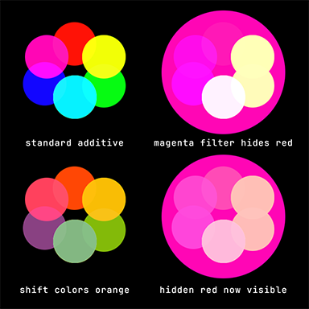{class=no-lightbox}

Indeed, magenta hides red! But if we could somehow shift the colors to be more
orange and yellow, then a hidden red would come into the visible color spectrum
under a magenta lens.

Applying the [burning man](research-burningman.md) logic and recognizing that
[Johnny/V/Player is the world](theory-dreamscape.md), I set V on fire. The
thought process is that if I'm the world, and I need to be more yellow/orange,
fire would do that right?

And that it does. By burning the city (and extension V/Johnny/Player), a hidden
red makes its way into the visible spectrum:

Before & After
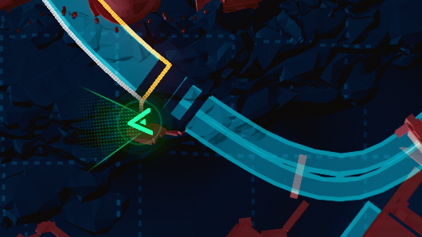{data-slider}
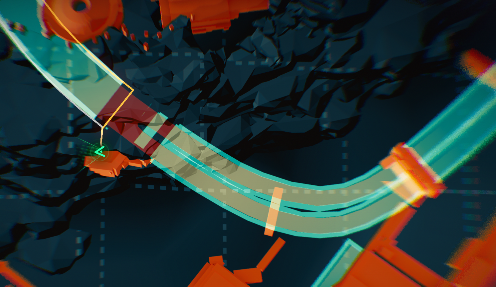{data-slider}

Underneath all cyan roadways is a pure red flow, hidden from our drone-like
perspective. This causes a problem, though. If this road shows up when the map
is orange shifted, then the map colors we see can't be correct either. I then
set out to dissect the true colors of the map by removing the magenta filter.

Now we find ourselves in an interesting logic problem: If our perspective of
the map is not yellow and cyan, then Ghost Tunnel cannot exist - and yet it
does.

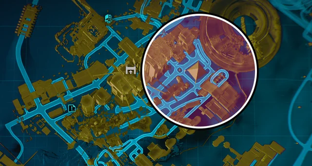

So okay, the map from our view is yellow and cyan. Do we ever see this anywhere
else? We sure do. During many of the prerelease videos, the map is shown in
these very colors. complete with red flowing into the city like blood:

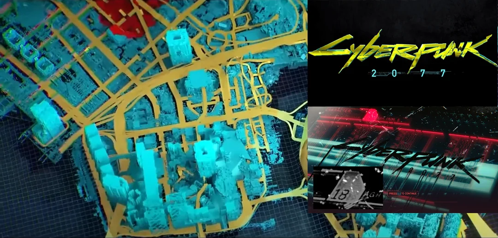

Additionally there are a few more tie-ins for this:

- On the title screen, the expected yellow and cyan logo is blacked out
- Next to the scrambled character name is a red number 18, mostly concealed by
  the surrounding magenta.

The one caveat here, is that instead of red blood flowing into cyan buildings
against yellow roads, we see red blood flowing into cyan roads with yellow
buildings. An interesting inversion.

## Exploring The Tunnel

### Inside

If you travel the length of the tunnel, you'll find some interesting details.
There's a Zoetrope effect (think flipbook images) pattern on one side. There's
also LED reflectors in the middle with odd behavior. They are either yellow or
cyan.

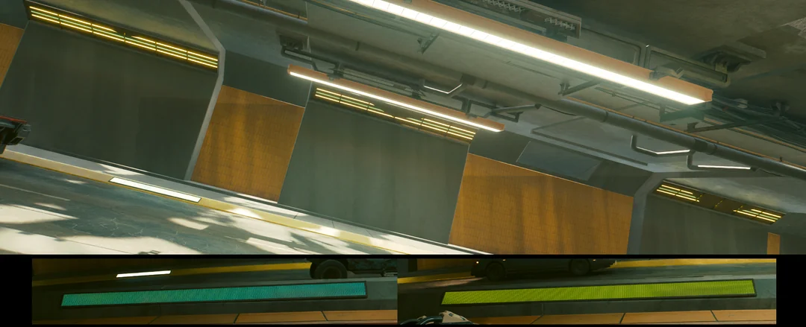{class=no-lightbox}

If we apply one concept to the other, then you could get an optical green by
strobing cyan and yellow together very fast in sequence in front of a viewer
(Zoetrope effect).

Additionally, the angled lights with the object coming into view are very close
to the Quadra Turbo-R 740 tail light profile, a car that comes in colorways
that can trigger [color ghosting](theory-color-3.md):

Quadra Turbo-R 740
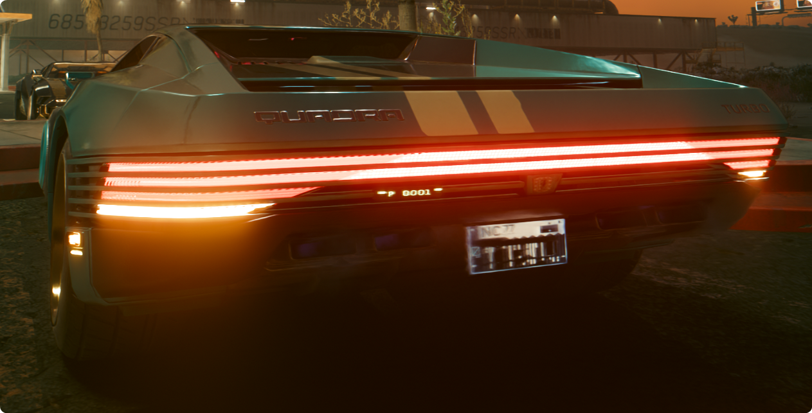{data-slider}
{data-slider}

### Outside Viewing Area

In the caged viewing area of the tunnel, there is a single structural column
with some graffiti on both sides. During certain hours and weather, you can
also catch a faint eclipsing color of red and green.

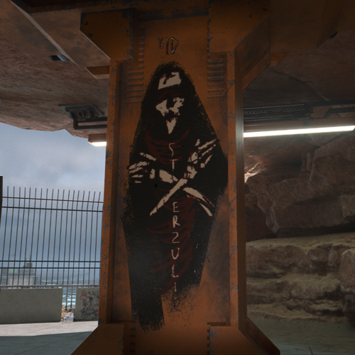{data-slider}
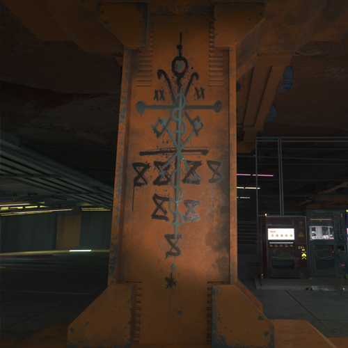{data-slider}
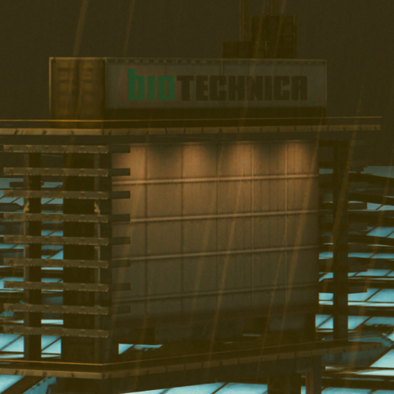{data-slider}

### Epicenter

The area at the epicenter above this tunnel was added in Phantom Liberty -
Terra Cognita (or "Familiar Land"). In particular the Digimmortal exhibit. This
building depects a cybernetic upper body with mantis blades and a missing
bottom half - cables dangling from the torso. We also get a glimpse of a double
helix (DNA) strand at the top, reminescent of [Mapping Cyberspace](alt-cyberspace-mapping.md).

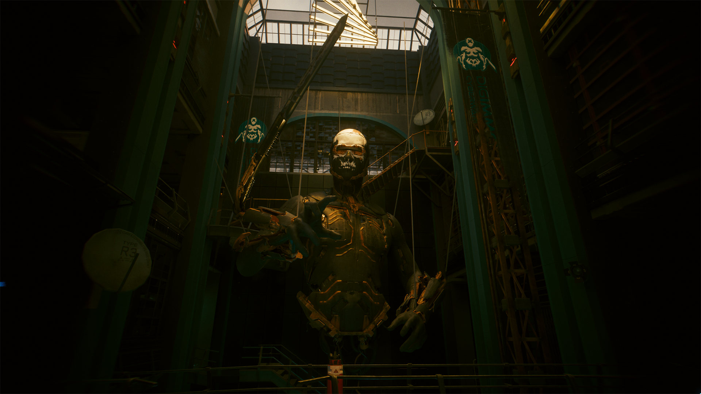{data-slider}
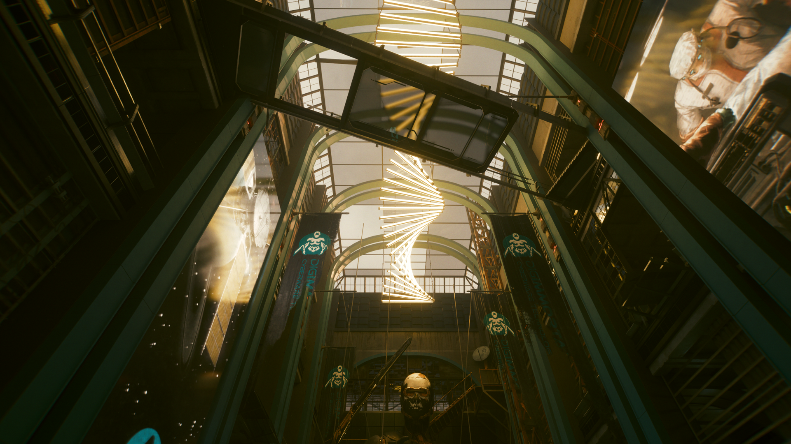{data-slider}

We're left with an entity with no bottom half, and a [V with no top
half](research-burningman.md#a-parallel). This rests against a backdrop of DNA
and surgery. Interesting combination of concepts.
