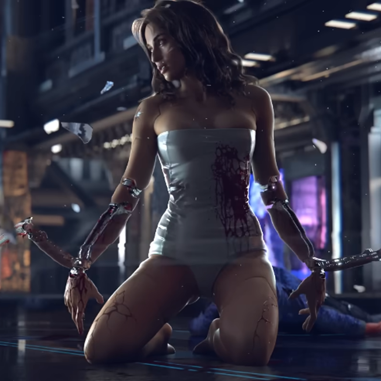
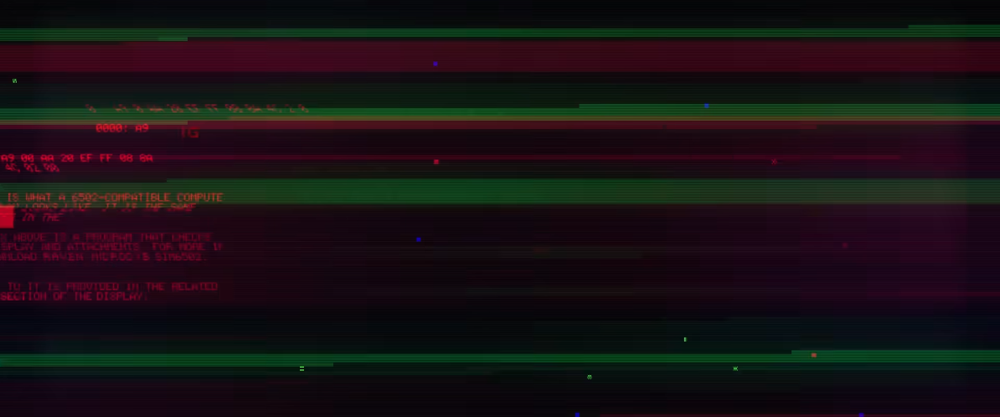
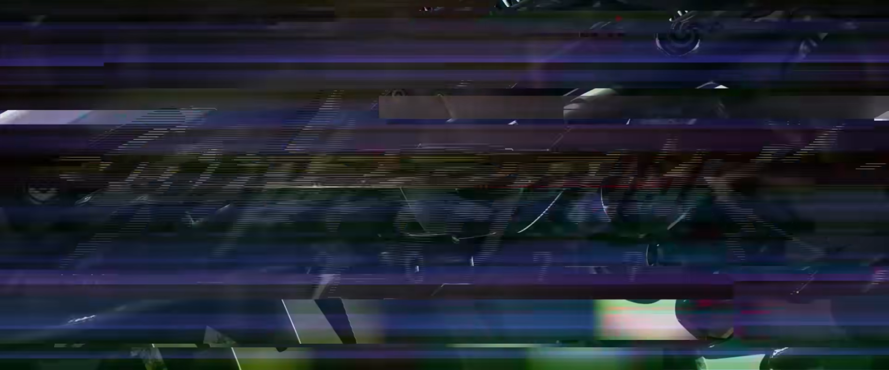
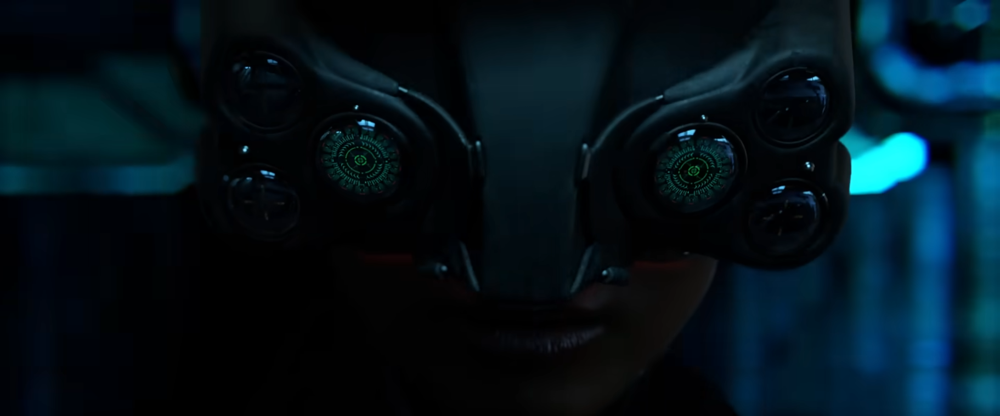
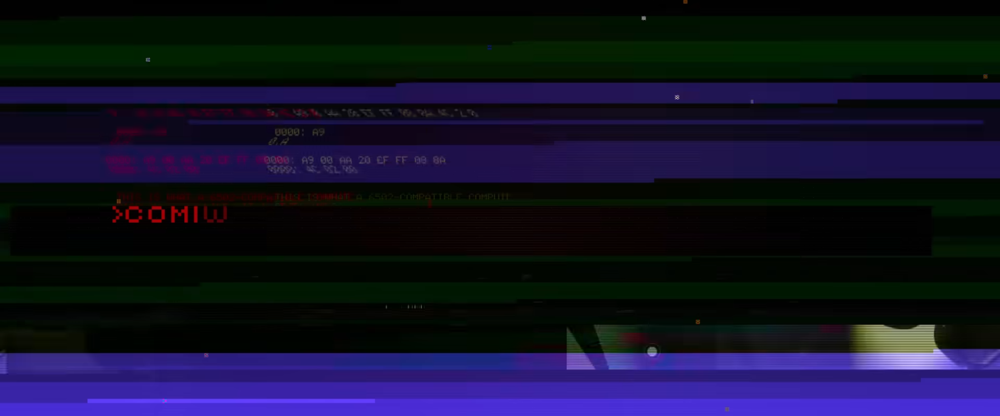

# The Truth About Melissa Rory

{class=no-lightbox}

> The Media Lies

- Regina Jones

## About

Long ago, CDPR released its [first teaser
trailer](https://www.youtube.com/watch?v=P99qJGrPNLs) for Cyberpunk 2077. This
trailer features Maxtac taking a call for the cyberpsycho attack perpetrated by
Melissa Rory. The scene cuts to the game's title before the gun goes off, and
the next scene leads us to believe that she was rehabilitated and assimilated
into Maxtac as an operative.

This is false, and to see why, we need to dive into the frames.

### How it starts

The initial frame before the video begins is this one:

{class=no-lightbox}

Before I go into the sequence of the video, I should probably explain what you
are looking at here since I know I'll get questions about it:

```
:0000 A9 00 AA 20 EF FF 08 8A
:0008 4C 02 00

This is what a 6502-compatible computer
display looks like. It is the same
one used in the The hex above is a program that checks
the display and attachments. For more info
download Raven Microcyb SIM6502.

A link to it is provided in the related
links section of the display

```

This is an 8-bit program that decompiles into the following:

```asm
LDA #$00    ; Load accumulator with 0
TAX         ; Transfer accumulator to X register
JSR $FFEF   ; Jump to subroutine at $FFEF in the system
PHP         ; Push processor status onto the stack
TXA         ; Transfer X register to accumulator
JMP $0002   ; Jump to address $0002
.END

; This program creates an infinite loop, running some 6502 SYS function at
; address $FFEF in the middle of the loop.

```

For now lets just focus on the frame image as the "start".

## Before the Logo Cut

The video is shown in 2 segments. In the first, Melissa is on the street with
a gun to the back of her head. The transition frame is below:

{class=no-lightbox}

Notice the gun still pointed at her head, barely visible behind the logo.

## Afer the Logo Cut

Did the gun fire? The next scenes after the logo will convince you that it
didn't, as Melissa is now aboard a Maxtac vehicle, suiting up and putting on a
visor.

{class=no-lightbox}

## The Problem Frames

At the end of the video we get our coming soon text - but there is a problem.
There are two frames that are out of place. Remember the gun frame just before
the Maxtac visor scene? The visor scene ends with the following frames:

2 Problem Frames
{data-slider}
{data-slider}

Why did we get these two animation frames? Why does the gun seemingly go
forward with a bright light? If it was fired, we'd expect kickback - not
forward momentum.

Unless, like was the case with [Peter Horvath](time-as-a-loop.md#the-second-indicator-peter-horvath), this portion has been inverted and plays backwards.

If we reverse the AV/visor scene so that the gun frames are together again and
the order corrected, we get a very different final outcome:

<div class="video-wrapper">
  <iframe style="width:100%; aspect-ratio:16/9;" src="https://www.youtube.com/embed/blEPXxZoO6w?si=fcSBNqq3Uo7ArpuK" frameborder="0" allowfullscreen></iframe>
</div>

Melissa closes her eyes. The Maxtac agent fires, the gun kicking back in bright
light. The moment of death.

Shock and surprise come across her lips as she takes the visor off. The visor
reflects her partner collapsing to his seat. Taking a moment to process what
just happened, she looks down dejectedly before the scene fades.

What does this mean? Was she soulkilled? Playing a simulation? And what about
the infinite loop program that wraps the video?

At least to me, it seems Melissa has been caught in the same prison as V, who's
one-way ticket is measured in calibur.
