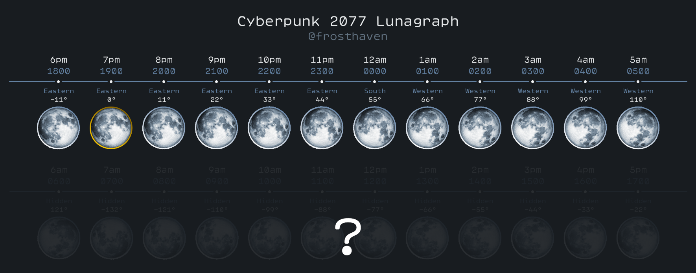
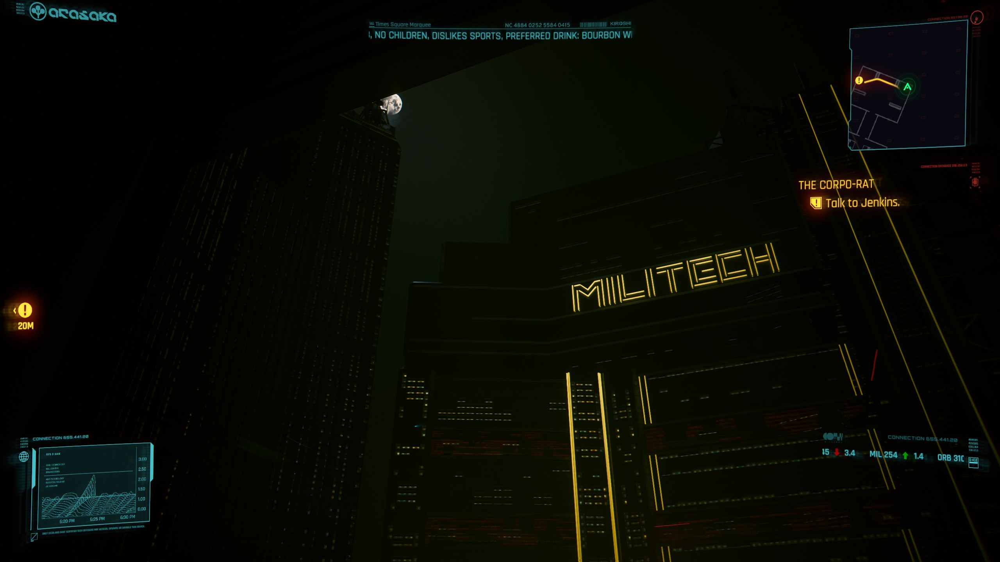
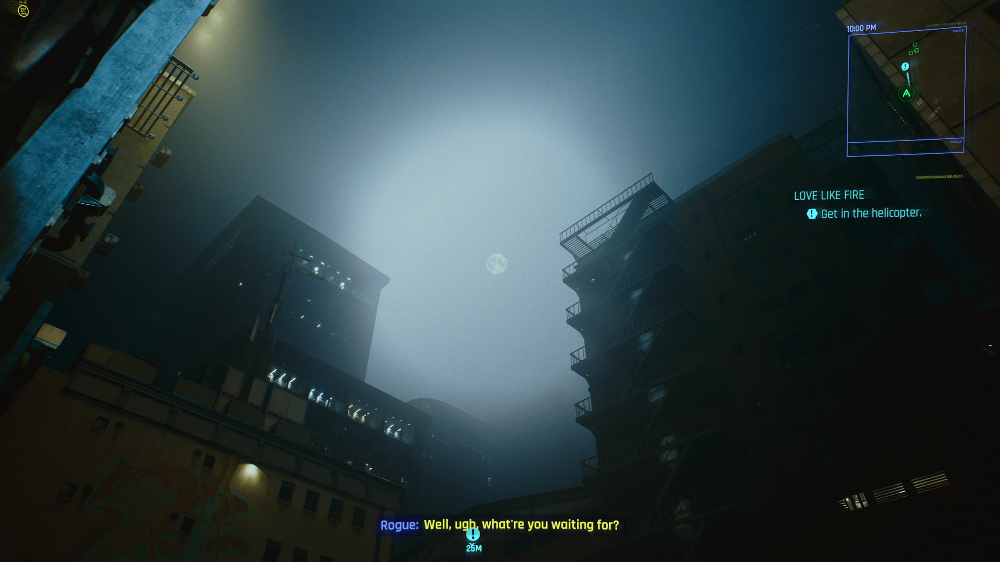
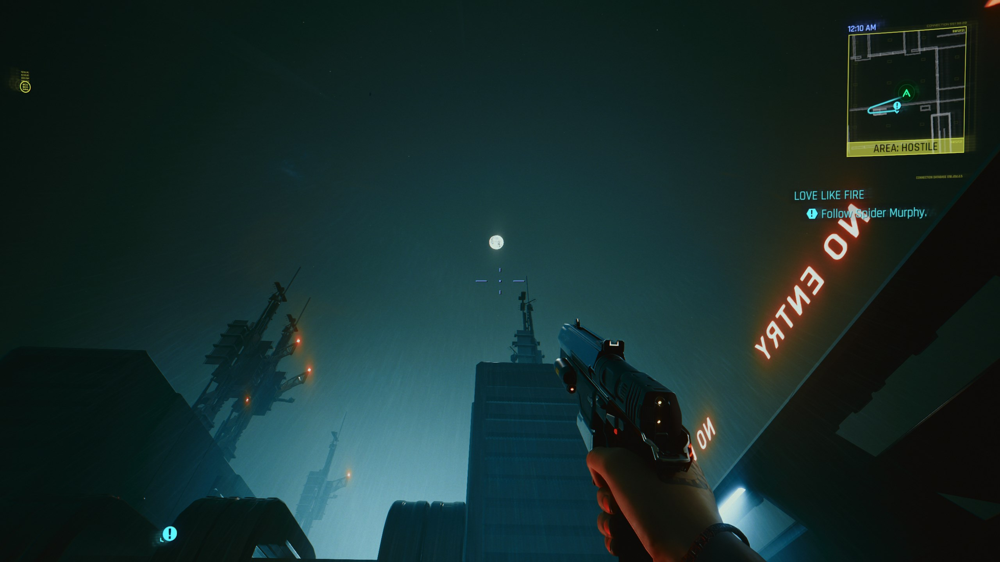
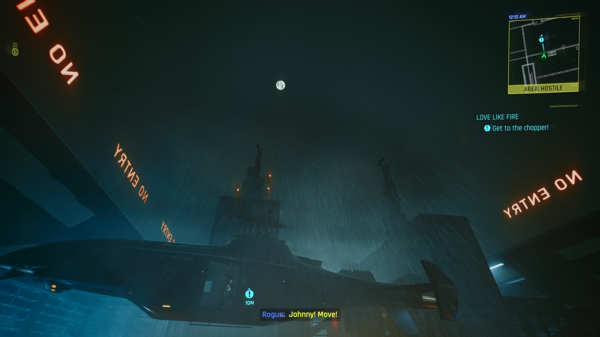
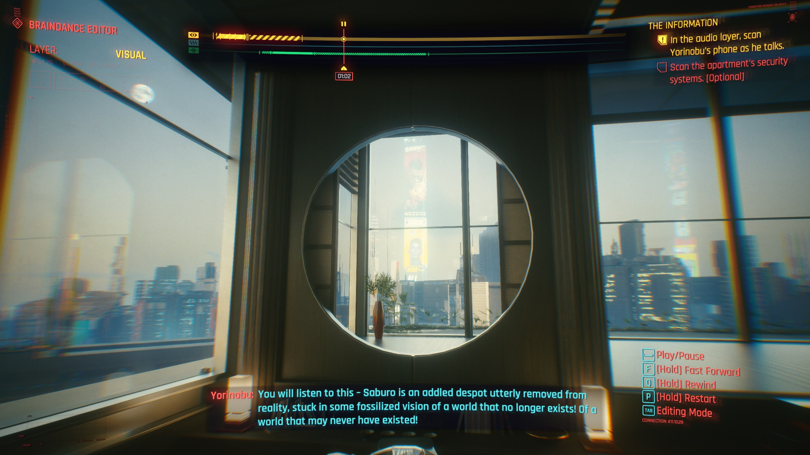

# Mystery Moon

{class=no-lightbox}

## Moon Time

The moon in game does not behave as it does in real life. Through normal gameplay
within Cyberpunk 2077, **the moon rotates approximately 11° per hour**. This is a
*significant deviation from reality*, as the moon in real life is in lock-step
rotation with earth and never changes its perceived rotation.

I have been able to tell time by comparing the in-game moon's rotation to this
chart I put together:

If you look at the moon at any point in normal non-quest gameplay, you can match
the moon's phase to the chart and determine the time of day with 100% accuracy.

Why 11° per hour? I don't know. I just know that 10° per hour is too slow to
stay in sync with the game's time, and 12° per hour is too fast. **11° per hour
is the only value that works.**

## Limitations of the Lunagraph - Questions

The moon rotating 11° per hour raises the following questions:

- If it spins 11° and there are 360° in a circle, then the moon will complete
  a full rotation every 32.7273 hours. This is problematic for a 24 hour clock.
  Where does the moon go for the other 8.7273 hours? Does this have to do with
  the extra loops in the serpent's body?
- Several key moments, especially endings, seem to deviate from the chart.
  Is the moon moving or are we? What can account for these deviations?
- When the moon isn't visible, is it changing rotation speed or direction? Is it
  flipped? Is it even moving at all? **What rules is it playing by?**

## Hidden Moons

**The game will often obfuscate the current time**, while making the moon visible
if you know where to look. I will attempt to catalog these moments below.

### The StreetKid

{loading=lazy}

In the street kid path, you can catch a small glimpse of the moon immediately after
leaving the bar by stand on some garbage bags. It's obscured for the rest of the
opening.

### The Corpo-Rat

{loading=lazy}

In Jenkin's office, if you crouch down in the far right corner of his city-facing
window, you can barely bring the moon into sight. This moon matches up to **11pm**
on the lunagraph. The same time of the Smasher fight at the end of the game.

### The Heist

@todo (Konpeki Window) - what about before meeting dex and after waking?

### Love Like Fire

Love Like Fire Moons
{loading=lazy data-slider}
{loading=lazy data-slider}
{loading=lazy data-slider}

### The Information

When walking through Evelyn Parker's scroll of the penthouse suite, there are only
a couple of frames where you can see the moon. If you stay in first person mode,
You will have a very brief window to catch an **8pm** moon as Evelyn takes a drink.

### Endings

@todo (panam for sure, temperance, star, etc.)
