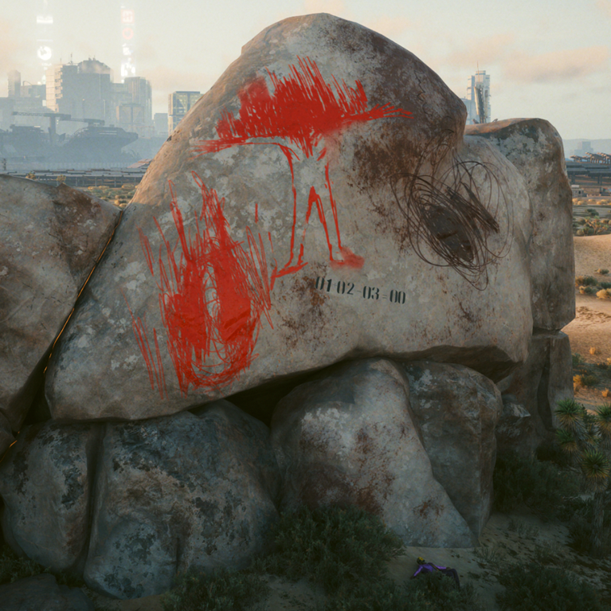
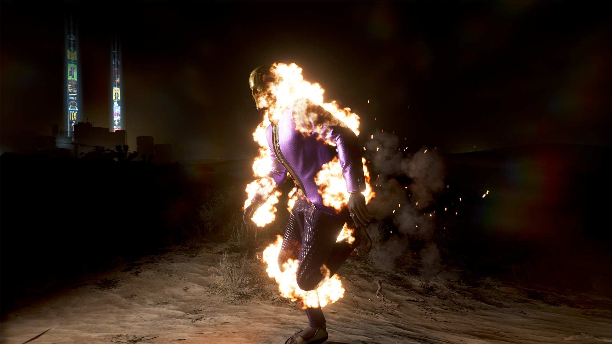
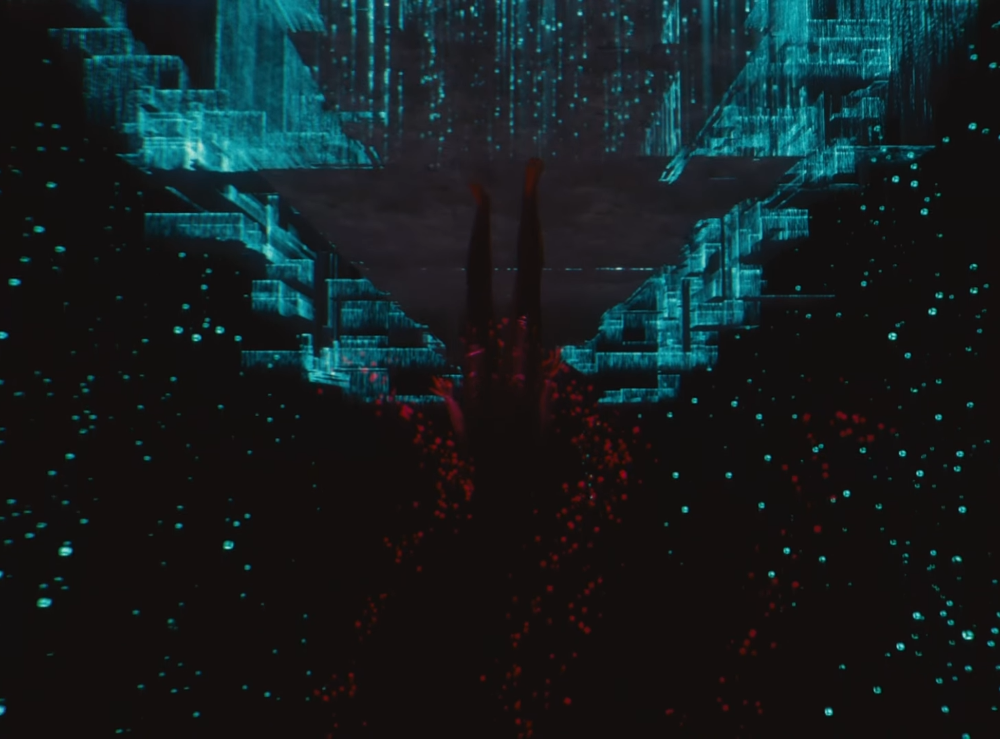
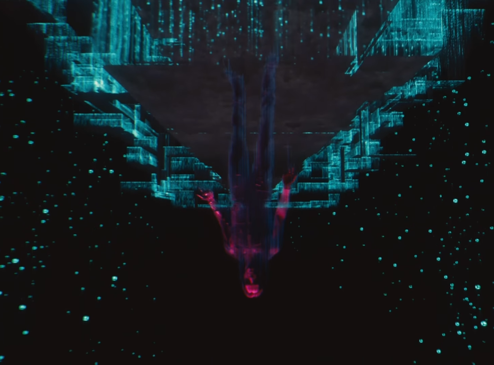

# The Burning Man

{class=no-lightbox}

# About

This is a specific graffiti that depicts a humanoid figure who is scratched out
above the chest. The style of this graffiti matches the existential line of
graffiti art, attributed to the ramblings from Pawel's personal notes. Often
making claims such as "I am not me" and "I did not write this".

Although you can find this graffiti throughout the city in several nooks and
crannies, this particular location has a follow up event nearing midnight.

## The Event

Just before midnight, a cybernetic individual with a human voice and purple
dress coat runs past the rock while on fire. On his corpse after he collapses
a blue quality overheat quickhack can be found.

## A Parallel

We see this same general effect ourselves in the game, specifically after going
into the light stream at the edge of the pyramid shape:

Dissolving Into The Light Stream
{data-slider}
{data-slider}

## 01 + 02 - 03 = 00

This is a simple equation. Since it gives us the answer, that can't be the point.
I can't help but wonder if the process is the point. Add two things together and
subtract equal parts to end without a remainder.
