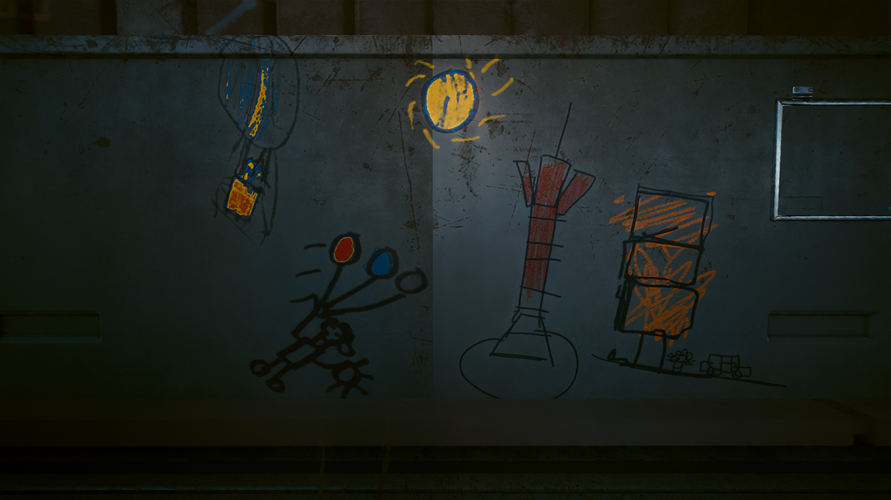

# Child Drawings

{class=no-lightbox}

## Introduction

I believe that the drawings of children in Cyberpunk 2077 contain wisdom. I will
attempt to decode their meaning from the perspective of a child, and list my
confidence levels in the interpretations.

## Johnny + V

{loading=lazy}

@todo show default V design, mirrored johnny. Show alternate image with texas
logo.

## Robotic Escape

{loading=lazy}

@todo not sure here

## Bringing In The Catch

{loading=lazy}

@todo show the color wheel transition, dragging corpo fish behind. Compare/contrast
to demiurge we get on opposite side of color wheel.

## Altered Bird Call

{loading=lazy}

@todo show correcting logo to red with hue rotation / makes monster eyes match
serpent emblem. Show monster on face of moon. Get less discolored variant.

## Balloons By Day

{loading=lazy}

@todo show johnny gaining color in opening and how world is painted through
V and Johnny. Remind of Saburo's office in love like fire/total immortal.

@todo show how ranger in balloon matches hologram rangers (twins) in rogue ending
path. Show how this further matches vanishing arasaka rangers who vanish in DFTR,
that you have to be incredibly quick to notice. Wonder if CDPR was expecting
speed runners to notice sooner?

@todo point out person standing at base of colored building and how it matches
the "traveling the curve" drawing.

## Traveling The Curve

{loading=lazy}

@todo explain how looking up at the sky, you would see this view from traveling
aircraft. tie into mega-building drawing.
