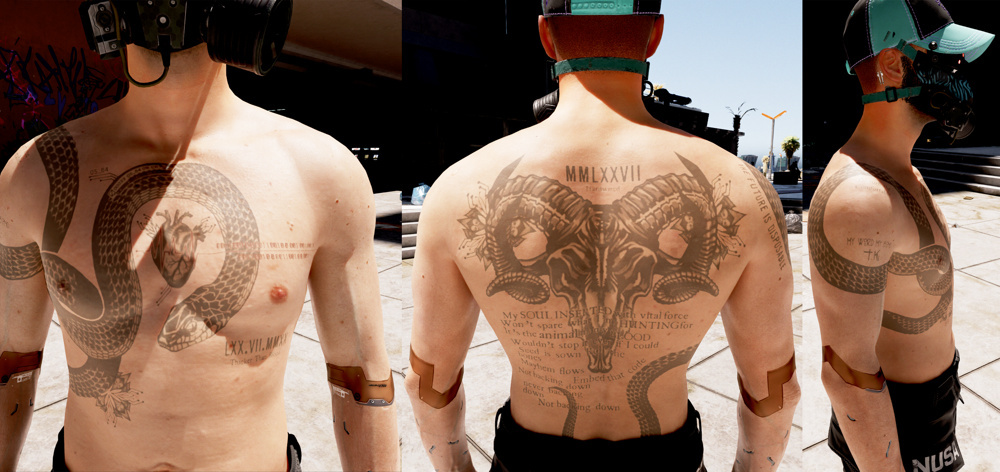

# Ink

{class=no-lightbox}

## Foreword

In real life, a good tattoo encodes within it meaning significant to the person
who wears it. In Cyberpunk 2077, tattoos are no different. They are a form of
self-expression, a way to tell the world who you are, or perhaps who you want to
be. In this line of research, I'll explore the tattoos found in the game.

## Body Tattoo 03

{data-slider}

### Front

#### At the top of the snake

```
05_64
```

#### Along the snake's scales

```
00033 05_64 O(B?) SP
```

#### Binary Division

```
0011001000011001000010010010
----------------------------
001100100001100100001
```

The interesting thing about this sequence is two-fold:

- The binary numbers have a large amount of shared digits.
- You can't treat it as traditional 6/8 bit binary, as the two numbers don't
  fit into that format.

If we instead focus on what's different between the lines, we can see that the
numbers _do_ split evenly into 7 bits.

```
0011001 0000110 0100001 0010010
-------------------------------
0011001 0000110 0100001
```

If we then convert _that_ into numbers, we're left with the following:

```
25 6 33 18
----------
25 6 33
```

- Completing the division treating them as full numbers leaves us at
  `100.0007022197948`, which is _almost_ 100, but slightly over.

- Completing the division treating the bits individually puts us at `1 1 1`
  with nothing to divide `18` by.

The interesting thing here is the extra `0010010` (or decimal `18`) on the
first line, which prevents clean division. `18` is the number of the tarot
deck's major arcana card "The Moon". This card is often associated with
intuition, dreams, and the subconscious.

#### Roman Numerals

```
LXX.VII.MMXX
Thicker Than Blood
```

The roman numerals translate to `70.07.2020`. It _almost_ wants to be a play on
2077 - "seventy and seven and two thousand". The trouble is that the numbers
are too high - in the same way that the division line is too high.

If we instead view this in the `MM/DD/YYYY` format, we see that the month is over
the line of what we expect to cap at 12. If 01 is January, and 12 is December,
then there are `5.833333` years listed in the months field. This translates to
5 years, 10 months, and 0 days.

That leaves us with the following:

```
10/07/2025
Thicker Than Blood
```

One thing that comes to mind when considering what's thicker than blood - oil.
Could this relate to Johnny in the oil fields?

### Back

#### Roman Numerals

```
MMLXXVII
```

This converts evenly into `2077`.

#### Song Lyrics

```
 My SOUL INSERTED with vital force
Won't spare what I'm HUNTING for
It's the animal in my BLOOD
  Wouldn't stop it even if I could
   Seed is sown Roll the
  bones
   Mayhem flows
Not backing down [overlapping] Embed that code
    never backing
    down
        Not backing down
```

This is the "Chippin' In" song with a twist. Compare this to the original
lyrics excerpt:

```
...
My soul inserted with vital force
Won't spare what I'm hunting for
It's the animal in my blood
Wouldn't stop it even if I could
Seed is sown (I'm chippin in!)
Roll the bones (I'm chippin in!)
Embed that code (I'm chippin in!)
Mayhem flows
Not backing down
Never backing down
Not backing down, yeah
...
```

- The three "I'm Chippin in!" lines are removed
- The song seems to overlap itself instead of continuing in proper linear
  fashion.
- The removal of the first "Chippin' In" causes the "Roll the bones" line to
  get concatonated with the Seed is sown line.
- The remainder of the song typography is all over the place in spacing. This
  spacing is very reminescent of the spacing of the memory bands found in the
  title screen and many other places. I look at those in more detail under the
  [V as Code Injection](theory-broken-time.md) research.

In addition, there are capital case or bold print. Extracting only the
emphasized words, we get the following:

> SOUL INSERTED. HUNTING. animal. BLOOD

### Side

```
MY WORD MY BOND
     t.K.
```
