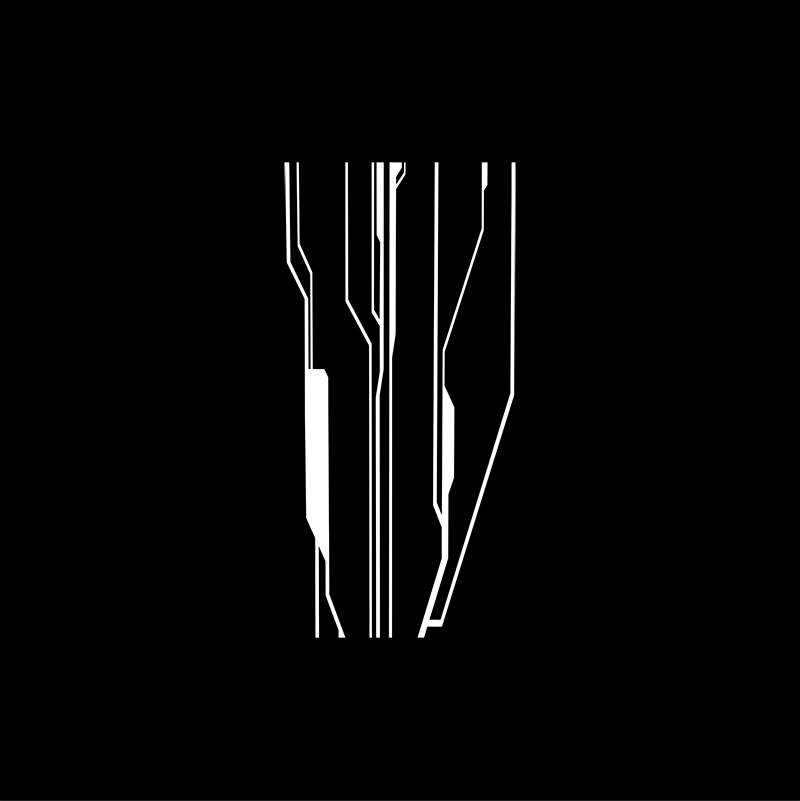
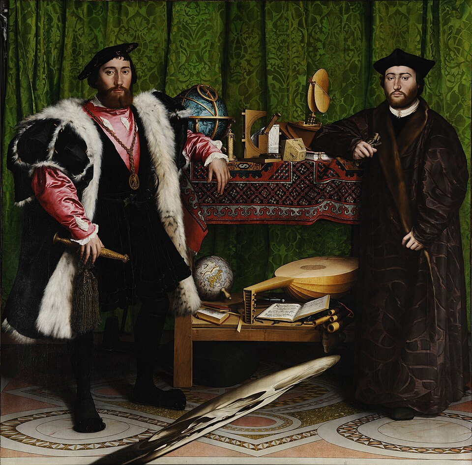
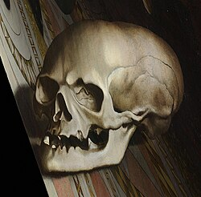
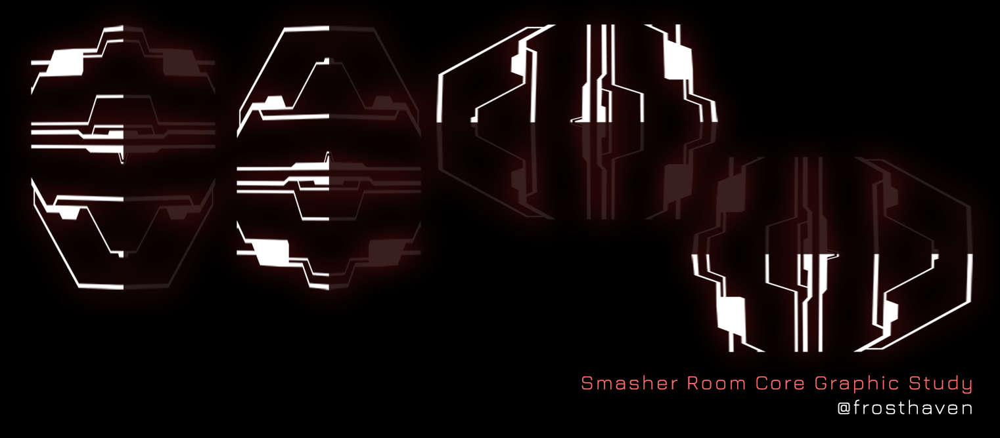
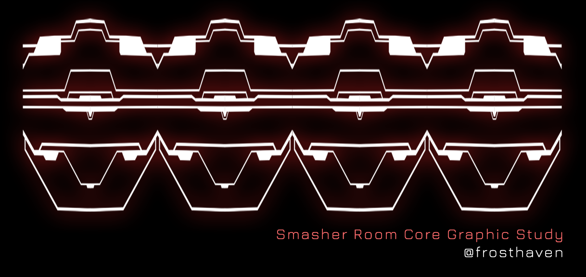
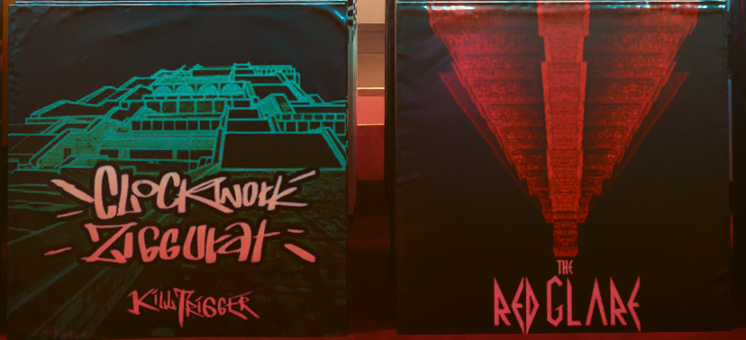
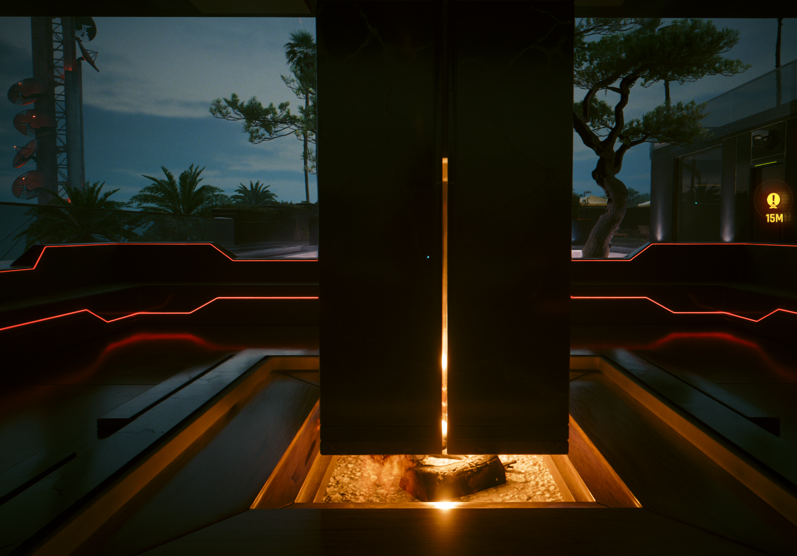

# Mikoshi Cores

{loading=lazy class=no-lightbox}

Two rows of cores numbered 0-7. The left side is surrounded in blue squares,
while the right is surrounded in red. A judgment card split down the middle is
nestled behind them, with an overwhelming sense of symmetry/asymmetry at play.

## The Strange Symbol

I've traced the symbol that appears on each of the cores here for easier viewing:

{loading=lazy}

### The Ambassadors (Holbein)

The symbol upon initial inspection seems rather tall. I've seen stretched
symbols before in the world of art - an example being "The Ambassadors".

{loading=lazy data-slider}
{loading=lazy data-slider}

### Processing the Symbol

By viewing the core symbol in the same way, we can attempt to destretch it and
analyze it further:

{loading=lazy data-slider}
{loading=lazy data-slider}
{loading=lazy data-slider}
{loading=lazy data-slider}

Ultimately it _seems_ that these symbols are pointing to the hidden "Don't Fear
(The Reaper)" ending existing, by expressing 4 pyramids instead of the 3 we
knew about prior to this ending path coming to light.

Or, it could be as simple as [stemming from an 8 bit 6502 system](melissa-rory.md#how-it-starts).

## Similar Structures

### Mega Buildings

The cores are very similar in architecture to the mega buildings that dot the
landscape of Night City. There are 8 cores, and there are 8 mega buildings that
are not inaccessible.

{loading=lazy}

### Arasaka Estate

The heated outdoor seating area at the Arasaka Estate also shares some very
notable architectural similarities with the cores. Seeing a fire underneath the
obilisk reminds me that we "have a city to burn".

{loading=lazy}
