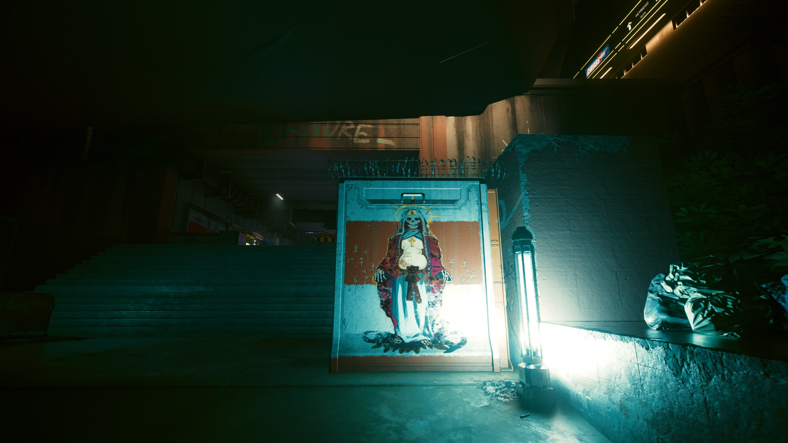
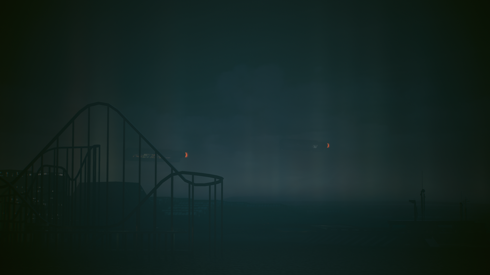

# Dancing Buildings

{loading=lazy class=no-lightbox}

The mega buildings have some interesting features as it relates to [color theory](./theory-color.md).
Many of the buildings seem to shift color to the inversion of another mega building
under certain time and location parameters.

There is a correlation between the red apparition on the cores and mega buildings,
as it turns out. There is a jumbled story that wants to unfold here. Can you see it?

## H01

H01 HW357
{data-slider loading=lazy}
{data-slider loading=lazy}
{data-slider loading=lazy}
{data-slider loading=lazy}
{data-slider loading=lazy}
{data-slider loading=lazy}

## H02

H02 WS708
{data-slider loading=lazy}
{data-slider loading=lazy}
{data-slider loading=lazy}
{data-slider loading=lazy}
{data-slider loading=lazy}
{data-slider loading=lazy}
{data-slider loading=lazy}

## A Note On Mega-Buildings

They are all a projection of the local environment:

{loading=lazy}

There is always a site nearby with flood lights that are either already
on and colored specifically, or that can be turned on. These sites almost always
seem to share qualities with the mega building they are associated with.

The mega buildings also have a habit of changing colors given the right time and
location. Take mega building H08 for example, that goes from pink and green to
orange and green:

Chameleons At Night
{data-slider loading=lazy}
{data-slider loading=lazy}
{data-slider loading=lazy}
