# V as Code Injection

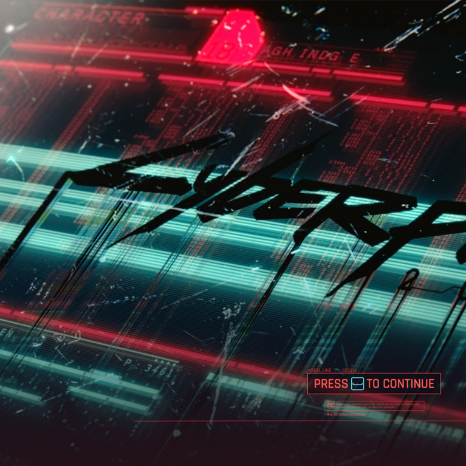{class=no-lightbox}

This line of research will attempt to show that the game is a memory module we
find mid-corruption due to buffer overflow.

## Quick Aside

There's some interesting color notes we can borrow from [color research
1](./theory-color-1.md) and [color research 2](./theory-color-2.md):

- We know that the title should be represented in yellow and cyan. But, at the
  time of the title screen we have not met Johnny yet who brings blues and
  yellows. As a result, the title can only be rendered as blank/black.
- The bottom left quadrant of the title screen emulates the low-health effect
  of V in-game. We know this should be magenta, but again we don't have Johnny
  yet to blend in blues and thus it can only render in red or cyan. We see it in
  cyan.

We can also see that the character name is scrambled, with a character level of
18 (the numeric 18 is in the chip to the left of the name, barely visible in
red).

## What Is A Buffer Overflow?

{loading=lazy}

A buffer overflow is a programming error that occurs when a program writes more
data to a block of memory, or buffer, than it was allocated for. This can cause
the program to overwrite adjacent memory, leading to unexpected behavior,
crashes, or security vulnerabilities.

If you can reliably force a buffer overflow, you can potentially execute
arbitrary code or gain control of the program's execution flow. One such
example is when a user programmed flappy bird into Super Mario World by playing
the game in a specific way
([source](https://www.youtube.com/watch?v=hB6eY73sLV0)).

## The Starting Memory Buffers

{loading=lazy class=no-lightbox}

Displayed prominantly in the center of the screen are 4 data buffers scrolling
downward and two cyan arms seeking up and down as if looking for something. By
pressing any button, we can "breach" into this system.

## The Payload

When we land on the title screen with no save files, and during character
creation, we see a different set of streams. This time a deep violet upload
stream is animated going upwards instead of downwards - symbolic of us
uploading our character into the system instead of staying inside of the
available buffers.

New Character Code Injection
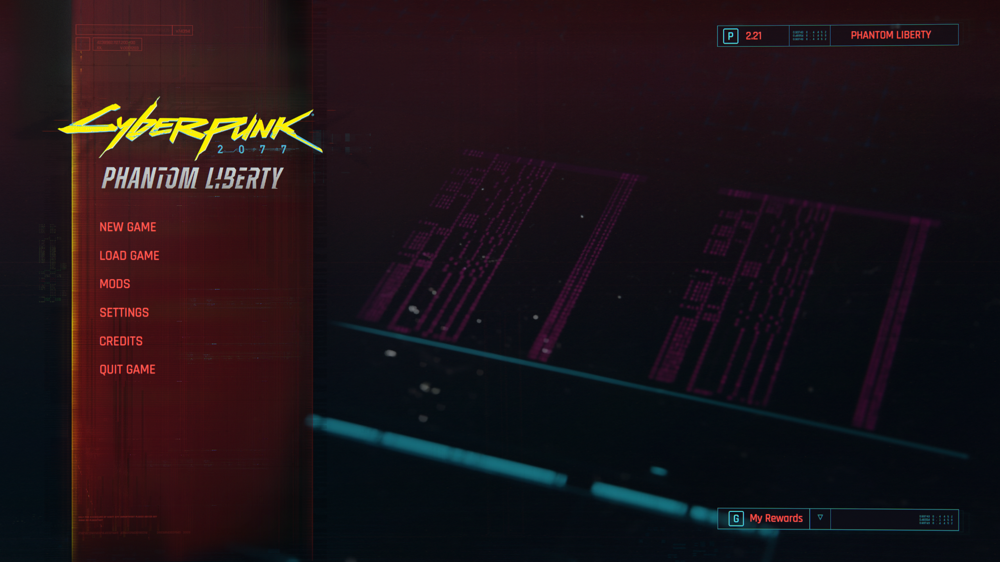{loading=lazy data-slider}
{loading=lazy data-slider}
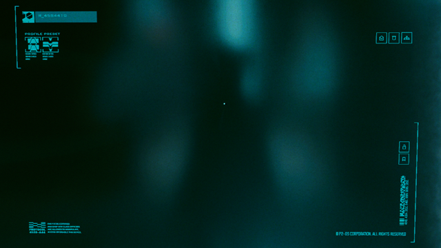{loading=lazy data-slider}

## The Ending Memory Buffers

When we finally reach the end of the game, we are once again presented with the
same memory buffer - but this time the color is blended between the red of the
title screen and the violet of our own character upload in a strong magenta
showing.

By going even further into Phantom Liberty, the magenta begins taking over the
entire screen, and not just the provided memory buffer.

_It's also worth noting that the ending slides have 2 buffers missing, which
coincides with losing half of our character's data through sacrificing V or
Johnny._

Ending Memory Buffers
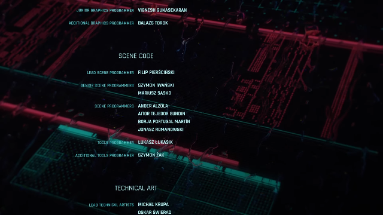{loading=lazy data-slider}
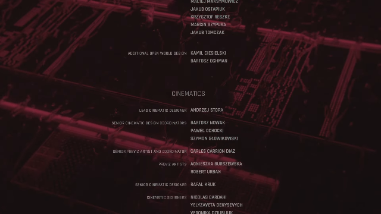{loading=lazy data-slider}

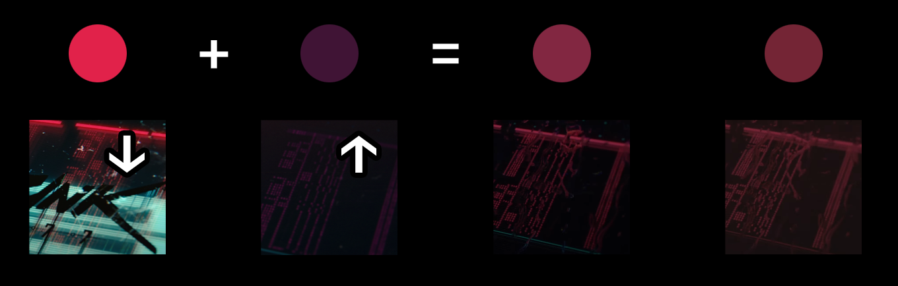{loading=lazy class=no-lightbox}

## Some Clues On What's Happening

### Buffer Overflow Hacking Glitch

In rare circumstances, we can see a glitch occur in the game where these memory
buffers are represented through our Kiroshi scanner. Normally you'd see this
behind the UI, but if you catch it there is a single frame before the UI is
rendered that reveals the glitch fully.

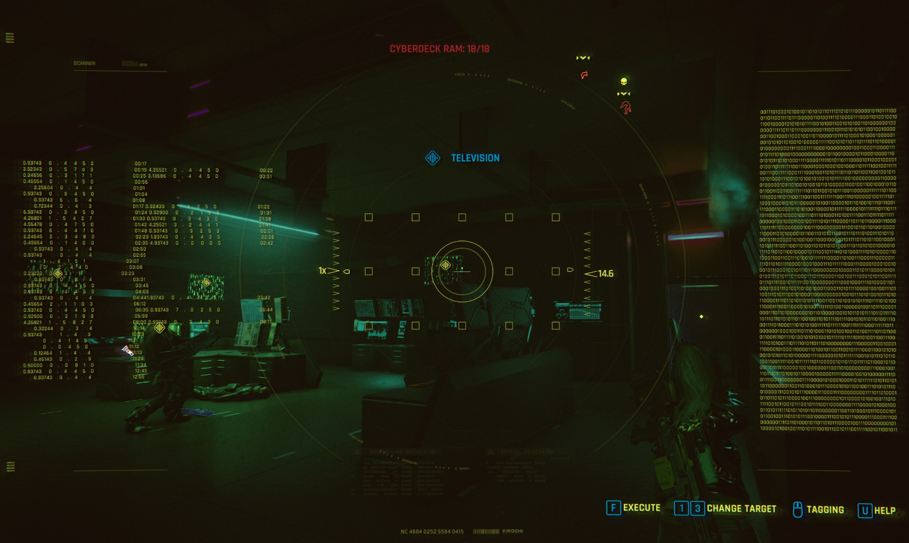{loading=lazy}

Screen Breakdown:
{loading=lazy data-slider}
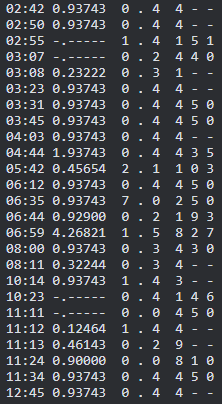{loading=lazy data-slider}
![The right side of this image appears at first glance to be a sequence of 1's and 0's, but if you look closely you can see that there are actually 2 pipe `|` symbols (yellow) that split the data. This is interesting, as files and software are generally split into 2 parts: the header and the data. The header contains metadata about the data, such as its size and type, while the data contains the actual contents. It would appear that data (pink) is overflowing (gray) and overwriting the header (white).](assets/oom-kiroshi-glitch-binary.png){loading=lazy data-slider}

### Arasaka Tower 3D

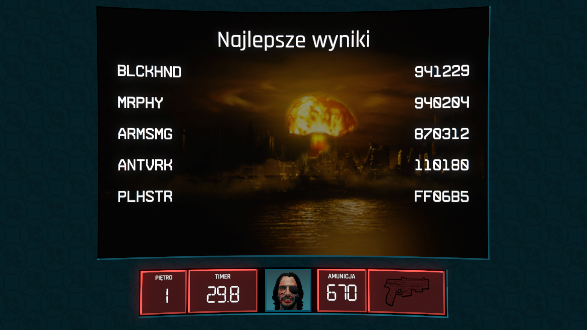{loading=lazy}

The "exploit" in Arasaka 3D is that the scoreboard totals are registered as
hexidecimal values instead of decimal. Where we would expect a max score of
`999,999`, we see that Polyhistor's entry exceeds this limit. The PLHSTR score
line results in `16,713,397`, which results in `15,713,398` more points than
should be possible. This means that the remainder of the score that doesn't fit
into the normal memory allocation is being written to the next memory location,
essentially corrupting and overwriting the game data.

This kind of buffer overflow hack for the arcade game is probably what allows
us the user to visit the -10 level (much like the [minus world in
Mario](https://en.wikipedia.org/wiki/Minus_World#:~:text=The%20Minus%20World%20is%20accessed,from%20the%20Warp%20Zone%20area.)).
It allows accessing memory locations that otherwise would be out of bounds -
leading to all kinds of glitches as the game loads data that it shouldn't.

Seeing magenta in the arcade game is one such-likely side effect of this buffer
overflow hack, as the arcade cartridge attempts to load the now-corrupted data
and make sense of the hexidecimal value.

## Visualizing Corrupted Memory

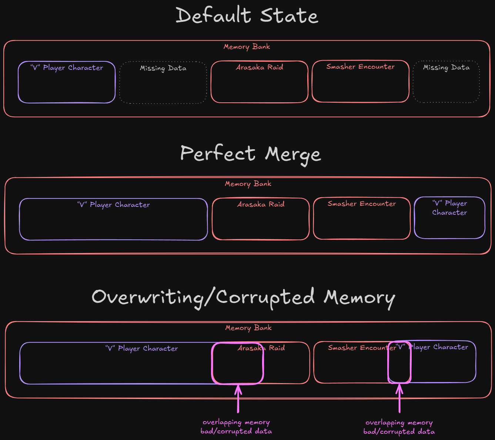{loading=lazy class=no-lightbox}

## Signs of Memory Corruption In Game

Much like the magenta and minus world in Arasaka Tower 3D, we'd expect to see
some form of telltale signs of memory corruption in the game. One could argue
that much like the arcade, this would take the form of magenta appearing in
the game world - being an overflowing amount of character upload data (violet)
going into the memory buffer (red).

### Quest Corruption

Corruption Through Quests
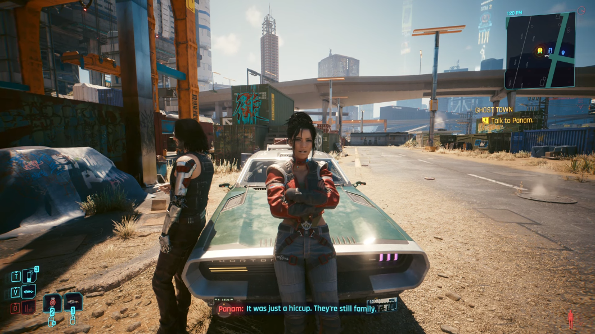{loading=lazy data-slider}
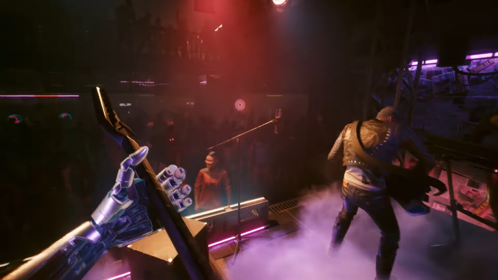{loading=lazy data-slider}
{loading=lazy data-slider}

In the correllary, we can also see a change throughout the scene transitions in
the game:

### Scene Transition Corruption

Corruption Through Transitions
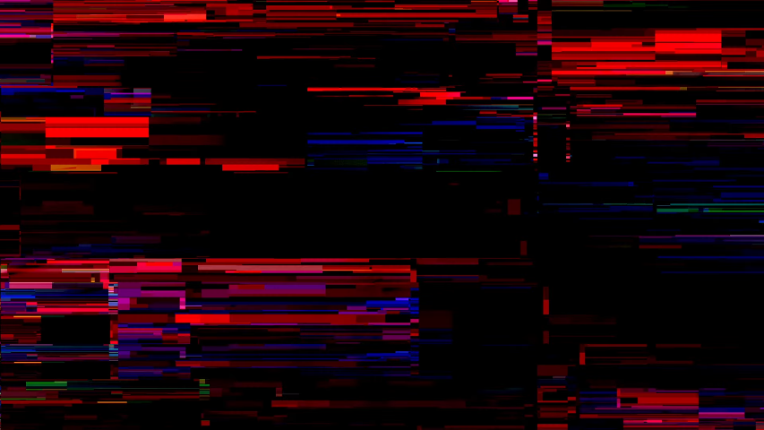{loading=lazy data-slider}
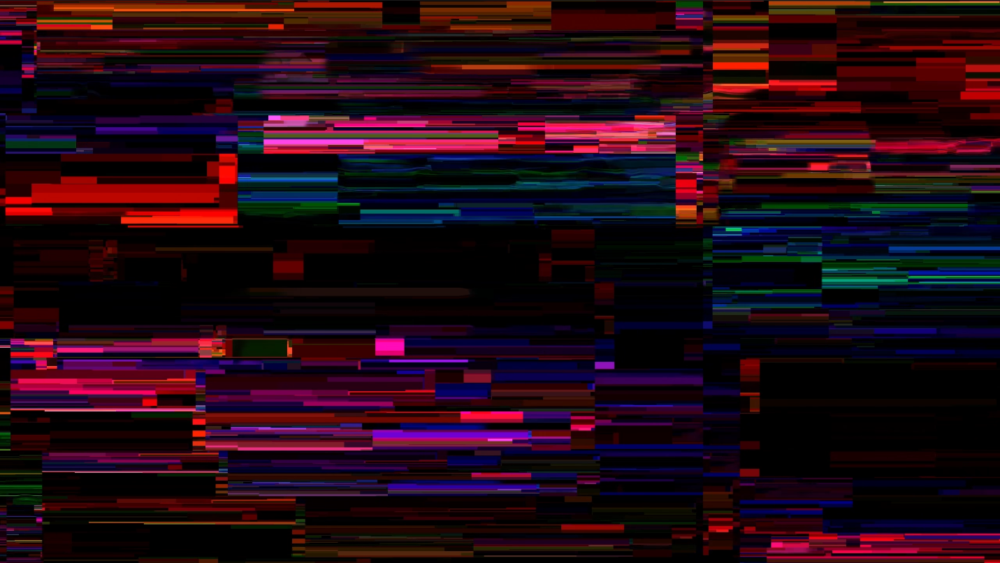{loading=lazy data-slider}

### Don't Fear (The Reaper)

This quest is often talked about for its strange experience. Despite Rogue
claiming that an all out assault from the front door is impossible, that's
exactly what we do.

- There's a chance to get at least 8 keycards when you need only 1.
- When going to the back of the lobby, there's 6 guards if you activate time
  dilation, but 2 vanish into thin air very quickly.
- A mech falls from the sky ala "The Heist" quest when entering the elevator.
- One elevator is labeled as "-2 Parking" as if we're at the megabuilding,
  despite taking us to netrunner operations.
- Despite not having received the shard from Alt (or the
  engramatic data of Alt), we magically have the shard to slot her in - and the
  choice to do so is optional blue instead of required yellow.
- There are elevator panels clipping through walls
- There's a locked -10 door with a mirror and unusable laptop behind it, random
  movie posters and a half eaten sandwich.
- Back in netrunner operations are scannable objects such as vents that make no
  sense and explosives clipping through computer kiosks.
- There's missing floorplans on terminals and an unreadable journal shards.

The entire area is a mess of glitches and clipping issues.

But that might be the point. If our violet upload is interacting with the red
data buffer, and we were to overstay and build new memories that overflow the
existing buffer, we might just find ourselves in a corrupted sea of data where
Johnny and V can take down Arasaka solo. It's possible that "Don't Fear (The
Reaper)" is a liminal space created by corrupting the memory buffer. It could
very well be the "-10" level of the game. We might have been seeing the hidden
minus world all along.

That begs the question, though - can we reach the end without corrupting the
buffer and oversaturating the system with new or corrupted memories? Or is it
yet to be implemented and a story for another time?
