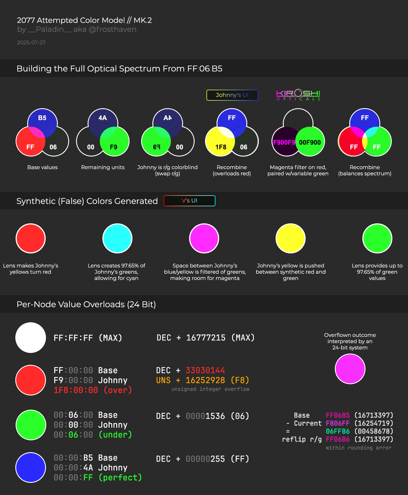

# Color Research 3

{class=no-lightbox}

## Overview

This line of color research is dedicated to documenting color anomolies found,
where light and color don't operate in the way we expect them to.

### Color Ghosting

There exist several points throughout the game where colors have a ghostly halo
around them. They usually follow a simple rule of opposites:

{class=no-lightbox}

Color Ghosting
{data-slider}
{data-slider}
{data-slider}
{data-slider}
{data-slider}
{data-slider}
{data-slider}
{data-slider}
{data-slider}
{data-slider}

Lizzies Bathroom
{data-slider}
{data-slider}
{data-slider}
{data-slider}

It's as if the color wheel is being folded in half in addition to a few colors
shifted along the way.

### COSMETIC_TROLL

2.3 Added the COSMETIC_TROLL twintone hack, which allows incompatible vehicles
access to color customizations by tricking the software into thinking you are
driving a Rayfield. Did you notice the color swatch in the top left?

COSMETIC_TROLL
{data-slider}
{data-slider}
{data-slider}

### Applying Known Swaps To The Title Screen

This is an expirement in trying to apply the knowledge contained within this
line of research.

Filtering The Title Screen
{data-slider}
{data-slider}
{data-slider}
{data-slider}

Before interpreting anything about this expirement, I want to point out what
this strategy has done. It pinpoints where the discolorations are coming from
that cause the red areas to look a little more pink normally.

Interpretively, this makes the title screen cyan and yellow, matching what the
logo should be. It also seems to imply that the chip is the cause of the
discoloration, as the inward heat is radiating out from itself as the source. A
magenta that is physically hot? Could this overheating be the result of a [buffer
overflow and corrupted memory](theory-broken-time.md)?

### Thoughts

Perhaps it isn't that colors are being swapped, but rather the case that things
are more than one color at a time? If we have the shared perspectives of Johnny
& V, maybe it isn't that yellow is actually red. Maybe the object is both
yellow AND red, leading to the anomolies we see.

### Attempting To Model The Colors

I began modeling possible color systems that could represent what we see in
game. The following 2 models are what I've come up with (still wip):

{data-slider}

It attempts to answer the following questions:

- Why V is red-magenta cast in cyberspace
- Why Johnny is blue-magenta cast in cyberspace
- Why V has Red & Cyan UI
- Why Johnny has Blue & Yellow UI
- Why Alt's engramatic data is represented in V's UI colors
- Why red and yellow are swapping around in some cases (Mint's car, wash buckets, etc)
- Why V can't see green all that well
- Why Johnny has trouble seeing red
- Why the player can't see magenta
- Why Johnny sees modern 2077 Night City in Atlantis behind orange tinted glass.
- Why V sees magenta while holding Evelyn's head one direction while Johnny sees orange while holding Alt's the other in these mirrored scenes.
- How the moon can be both magenta and not magenta at the same time.
- Which three perspectives are at play with the rotating cube.
- What is real and what is not real.
- Why the devil card is embedded in an at-the-time-unsolvable color cube in the Devil ending.
- Why V "tastes purple" if Arasaka removes Johnny
- Why Songbird interferes with Johnny when communicating
- How [Ghost Tunnel](ghost-tunnel.md) can exist and the cyan/yellow map on promotion material can still be true

### Theory

I think that V is a fragment of Alt, just like Delamain 21 was a fragment of
Delamain. We don't see it because we were dropped into the middle rather than
the start. It takes merging all 3 (player/Alt/Johnny) to generate the white we
see at the end of the game, which leads to a merge into the real world, while
leftover data gets recycled into the system as a new V. The corpo fish are the
balance of colors between Johnny and V, which means that this process already
took place at least once before.
