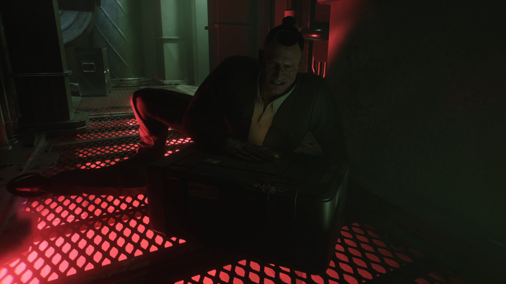
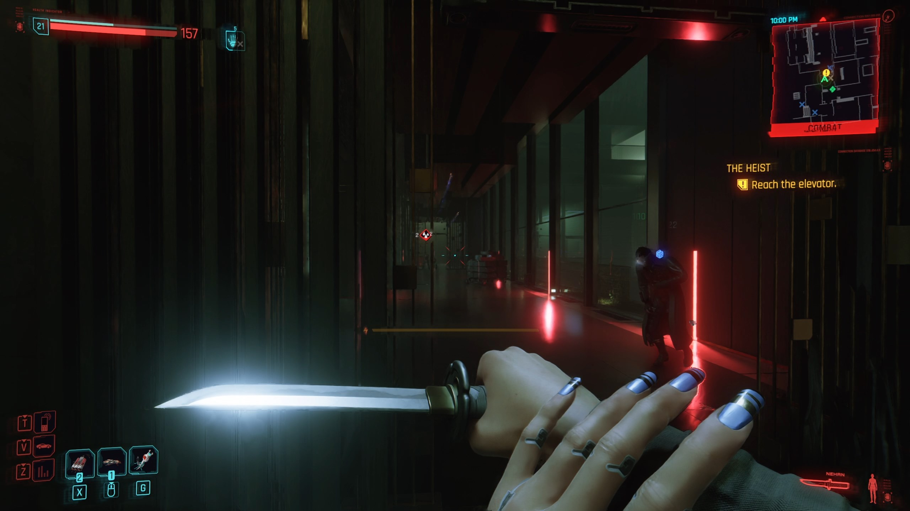
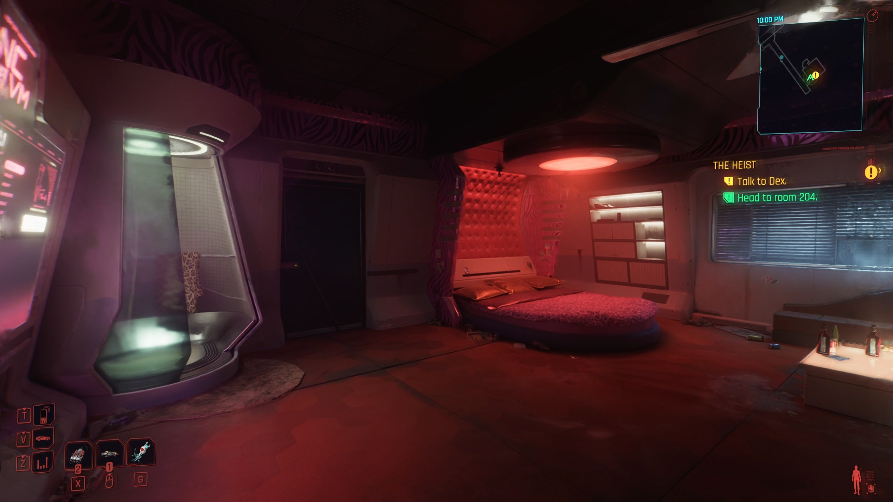

# Color Theory

{class=no-lightbox}

## Introduction

Color theory is a theory by which **CD Project Red uses colors to tell a hidden
story in Cyberpunk 2077**. The theory is based on the idea that the colors used
in the game are not just for aesthetic purposes, but are furthermore used to
convey a deeper meaning.

## The Color Axis

This theory requires a basic understanding of the RGB color wheel. I've included
it here for reference.' Looking at the wheel, we can see a pattern in the colors
used in-game and symmetrical axis. These color pairs are known as
**complimentary colors**. There are many symbols in the game that point to these
axis.

{width=300 align=left class=no-border}

The axis of initial color sets:

- **0°** + **180°**: Red & Cyan
- **60°** + **240°**: Blue & Yellow
- **120°** + **300°**: Pink & Green

The axis of intermediate color sets:

- **30°** + **210°**: Orange & Pale Blue
- **90°** + **270°**: Purple & Lime
- **150°** + **330°**: Teal & Magenta

> Symbols are more resilient than you think

- Hanako Arasaka

Color Axis In Symbolism
{loading=lazy data-slider}
{loading=lazy data-slider}
{loading=lazy data-slider}
{loading=lazy data-slider}
{loading=lazy data-slider}
{loading=lazy data-slider}
{loading=lazy data-slider}
{loading=lazy data-slider}

## The UI

The most obvious example of complimentary colors in the game is the interface:

UI Color Sets
{loading=lazy data-slider}
{loading=lazy data-slider}

## Mid-Game Title Screen Events

The second most obvious use of the axis is through scene color casting. I want
to focus on the main events in the game that occur on either side of the mid-game
title screen. These events are V's death and Johnny's awakening.

Johnny's Awakening: Blue/Yellow + Black
{loading=lazy data-slider}
{loading=lazy data-slider}
{loading=lazy data-slider}
{loading=lazy data-slider}

V's Death: Pink/Green + White
{loading=lazy data-slider}
{loading=lazy data-slider}
{loading=lazy data-slider}
{loading=lazy data-slider}
{loading=lazy data-slider}
{loading=lazy data-slider}
{loading=lazy data-slider}

The game's title logo appears in-between these two events, decorated in cross
hatch glitch effects. This signifies both the completion of the color wheel and
the beginning of the game.

- Johnny's color axis is right of center (Blue & Yellow).
- V's color axis is left of center (Pink & Green).
- Where the two meet in the interface/game is at 0° (Red & Cyan).

Johnny's axis being a reflection of V's is interesting, both because of the
mirror you can break before the transition and because Johnny's scene literally
rotates into view. *Not to mention that you can see Johnny in the mirror as an
easter egg throughout the game.*

Feel free to
[watch the transition](https://youtu.be/8jljcwOoTsM?t=81){target=_blank} for yourself.

## The World

{loading=lazy}

This is where we are introduced to a third common complimentary color set of
**orange & pale blue**. Based on the color wheel, this rests symmetrically between
Johnny's blue/yellow and the game's cyan/red at 30°.

*It is also noteworthy that the round foundation under the fish cycles through
the colors of the color wheel.*

## The First BD

An echo of the game's story
{loading=lazy data-slider}
{loading=lazy data-slider}

## Saburo's Office

> Father's office. A faithful replica of the original in Tokyo. He ordered one in every Arasaka branch on the planet. Every last detail, every item... arranged as if he could navigate it blind.

- Hanako Arasaka

Saburo's office gives us a chance to test the color axis. Take a look at the two
times we visit the office:

Saburo's Office - As Seen In Game
{loading=lazy data-slider}
{loading=lazy data-slider}

What makes the colors in "TotalImmortal" interesting is that it deviates from the
single-color axis shown in many of the previous slides. Instead, this scene
appears to be a composite image created from multiple color axes composited
together. It is very reminiscent of Johnny and V being inseparable by this point
in the game. @todo - show color composition slides

## Delamain

@todo list:

- offspring are fragmented colors of the color wheel
- discuss how it mirrors protagonist's journey
- discuss how it mirrors the game's color axis
- merging required a lot of intelligence - foreshadowing?

## Crosswalks

At a certain point, the black background in the **crosswalk lights begin shining a
random color** on game startup.

{loading=lazy}

## The Demiurge Creation

{loading=lazy}

If we take the serpent emblem given at the cube cutscene and focus only on the
order that the symbols appear (and their location), we can treat the emblem as a
color wheel.

Going from 1 to 2 is -75° on the color wheel. Going from 2 to 3 is a hue flip, etc.
This paints the story of the world's creation, starting with #FF06B5 and its
companion color as the key. We end with the duality of the corpo plaza fish -
emblematic of this world.

It's worth noting that this color companionship of magenta and green is within
color calibration margins of V, and leads to a palette that much more closely
resembles Johnny's. Below, we will attempt such a calibration effort.

## Calibrating The Smasher Room

{loading=lazy}

### The Approach

- The first thing to notice is that the room is cyan and red. We know how to get
  to Johnny or V's perspective by shifting hues.
- If Johnny was indeed cut in two, and work done on [dreamscape theory](./theory-dreamscape.md) is
  accurate, then we should expect some symbolism of only seeing one half.
- All cores are behind a yellow barrier. We will need to probably try mixing this
  in to get accurate core colors.
- The cores are behind either red or blue barriers. This may be another place we
  need to manipulate colors.
- The cores are all facing different directions, if we go by the apparition shown
  one side of each. We may need to rotate the final colors to connect to the middle
  (symbolic of putting Johnny back together).

### Attempts

You may want to open these images in their own tab or download them, as they are
quite large. Please note that some labels show "World", but those should really
say "interface", based on our findings combined with [dreamscape theory](./theory-dreamscape.md).

#### Attempt 1: WYSIWYG

{loading=lazy}

#### Attempt 1: Recap

We do see the symbolism of only seeing half when we hit our first step. By blending
V's red+cyan, we get gray. Same goes for the interface's yellow+blue and Johnny's green+magenta.

This one is interesting. The final result seems to mirror what "Alt" tells us in
cyberspace. Without accounting for the body, the only combination that doesn't run
into overflow errors is Johnny+Interface without V.

#### Attempt 2: Calibrating V to #FF06B5

{loading=lazy}

#### Attempt 2: Recap

Calibrating the colors to where V is #FF06B5, an interesting pattern emerges. Because
we can know that V's pink is #FF06B5, we can calculate the companion color shade of
green. Because we know that, we can apply it to Johnny's barrier colors. This chain
of calculation leads to an entirely corrected color palette.

I wonder if this is what "considering the body" or "the human factor" means, and
if it is the step that "Alt" was missing. The outcome here paints a very different
picture of whats possible, with both V and Johnny remaining compatible at the end.

## WIP

This document is unfinished. I will be adding more to it as I can.

## Useful Tools

- [Hex Calculator](https://www.calculator.net/hex-calculator.html)
- [Color Hue Rotator](https://imgonline.tools/color-hue)
- [Color Mixer](https://colordesigner.io/color-mixer)
