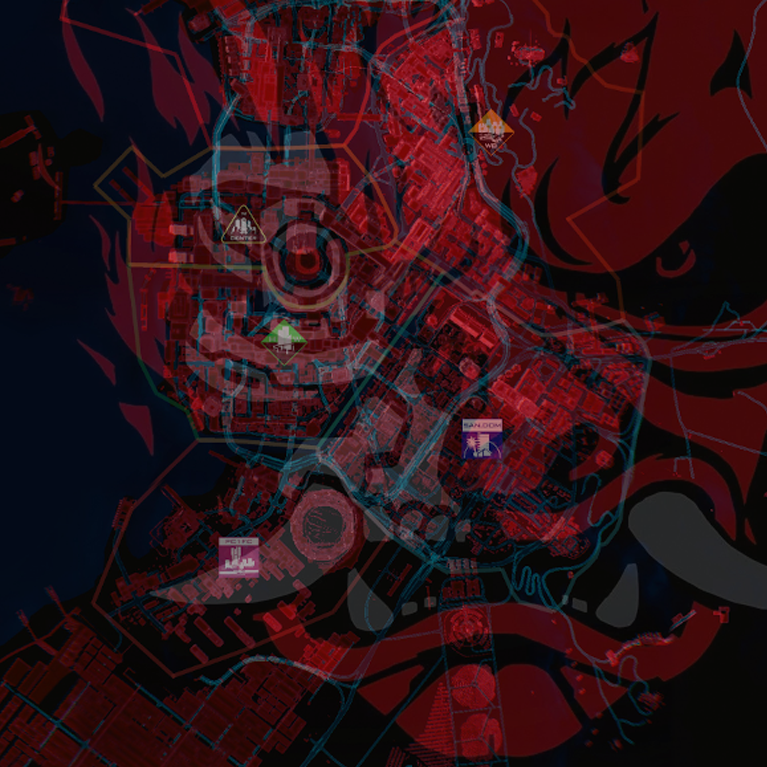
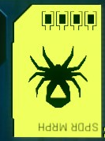
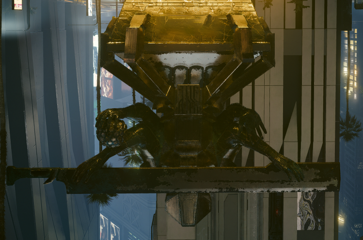
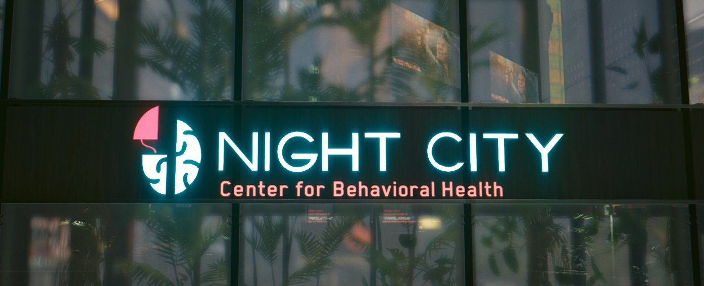
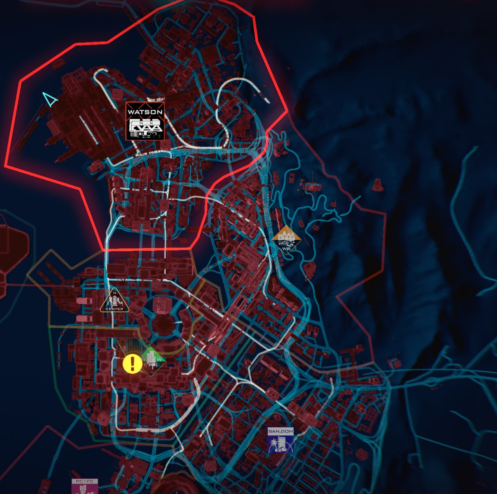

# Dreamscape Theory

{class=no-lightbox}

## Introduction

> We saw this place in a dream.

- Johnny Silverhand

This line of research examines the possibility that the entirety of Cyberpunk
2077's city takes place within the psyche of Johnny Silverhand.

We'll borrow some colors from [color theory](./theory-color.md) here:

- **Red & Cyan** is the game/system/interface.
- **Pink & Green** is V
- **Blue & Yellow** is Johnny

## The Setup

In Cyberpunk Lore, Johnny Silverhand was cut in two by Adam Smasher. Spider
Murphy hit him with a ranged ai-given data slug in the hopes that he could be
remade whole again. This slug carry's Alt's fingerprints: a deviation of
soulkiller.

Spider is known to cope with the harsh realities of the world by living
it out as if it were a game. Imagine what the process of the data slug might look
like in this context, and you'll have a running start to the sections that follow.

## The Beginning

> Love ya, Spider!

- Johnny Silverhand

> The whole world loves me!

- Spider Murphy

Tell me, what has 8 legs and can inject venom into its prey? I hope you don't
have arachnophobia. I've inverted these images so that you are less likely to
humanize them (and because the endings teach us the pyramid is upside down, but
I digress).

Spider bite
{data-slider loading=lazy}
{data-slider loading=lazy}

I'll borrow from [color theory](./theory-color.md) once again, in that we know
Johnny was limited to only seeing blues and yellows until V and the interface
came into his life.

## Watson Lockdown

Take note of the image that tops this research page - of the samurai logo laid
over the city map. If we combine our knowledge of V's color axis with the overlay
of the samurai logo, we can draw some conclusions as to why Watson is on lockdown
in the beginning and V cannot leave.

Let's start with the Arasaka logo Johnny first sees in his *disconnected from V*
state in "Love Like Fire" and see if you notice anything missing from it:

{loading=lazy}

The branches are missing, indicating that V/Johnny/System have not yet merged.

Why does this impact V? Well, remember V's colors - pink and green. Take a look
at this logo:

{loading=lazy}

Green nature in the boxes, pink separated part of brain connected only by a single strand. That's V's colors. "Night City"
*is in and of itself* the center for behavioral health, made apparent by being made
in red/cyan. That's the system/game/interface colors. The top left of the logo
depicts a disconnected Watson - a bridge that V will eventually cross.

Lets review:

- Spider injects FF06B5 into Johnny's psyche by way of an AI-given data slug.
- The digital landscape (cyan/red) builds up around Johnny's backdrop of blue (world map).
- V is the outside agent then introduced to Johnny in the hopes of making him
  whole again. Watson is ground zero.
- The game/interface compels V, much like an antibody, to merge with the host system
  and begin spreading to other areas (Watson lockdown lifted).
- The half deserted streets of cyan form the web of the spider, overlaying the
  blue ocean of Johnny's mind.
- Through V's actions of traveling these pathways, the neural network of Johnny's
  mind is reconnected.

{loading=lazy}

## Overlaps

There exists many areas that seem to overlap each other in either design, color,
time, or otherwise. Much like a dream where each scene builds off of the last. I
will attempt to catalog those here.

@todo list for pics

- konpeki plaza jailbreak (random exit gate+ladder matches general theme of BROOM ladder)
- the general 6 sided shape used in logos, johnny's quest indicator, color theory axis, etc
- the BROOM room mirror matching aesthetics of Lizzie's bar changing room.
- general overlaps between elevator floors in several places - H10 megabuilding, konpeki plaza, arasaka, etc
- Mikoshi access point matches power systems for city (same array setup under tower as at power station)
- etc
