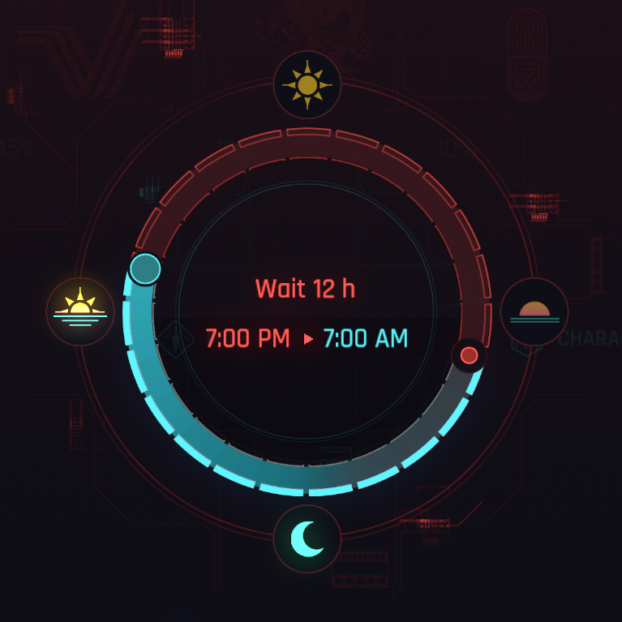
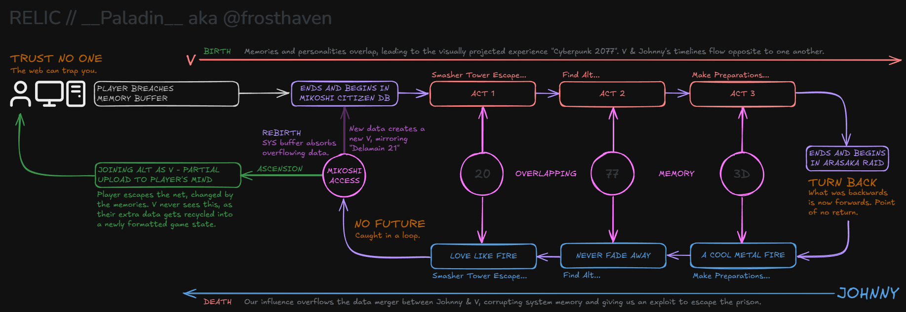
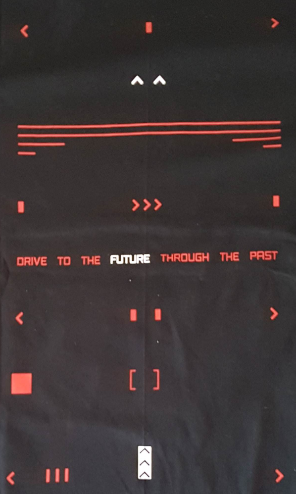

# Time As A Loop

{class=no-lightbox}

## Overview

If life is a straight line, starting at birth and ending at death, then how
would you fashion immortality? An argument could be made for simply connecting
the end to the beginning and scrubbing away the death scene in a perfect
circular cage. But what about preserving two timelines in one?

Have you ever noticed that if you skip enough time, the background effect
begins spinning in reverse? This research delves into the possibility of time
being a circle, where we can peer across from one end to the other.

### The First Indicator - Maman Brigitte

During the quest "Transmission", Maman Brigitte peers into your memories. When
this happens, a strange anomoly can be found - some of Johnny's memories are playing
forwards even though she's scrubbing backwards.

### The Second Indicator - Peter Horvath

Do you recall the [NCPD projection just outside of Misty's (external source)](https://www.reddit.com/r/LowSodiumCyberpunk/comments/14kkynb/outside_mistys_shop_never_seen_this_before/)? A man with the appearance of Peter Horvath:

1. Charges forward with presumably deadly intent.
2. Falls backwards to gunshot wounds by a police officer.

Later when investigating a BD with River Ward, we can see the following events:

1. River sets off an alarm, making the red security gate glow magenta.
2. Shortly after, Peter Horvath enters, humming a non-tune.
3. Peter Horvath stabs the security guard.
4. Peter charges forward with presumably deadly intent.
5. Peter falls backwards to gunshot wounds by a police officer.
6. The security guard sees his silver hand before the BD cuts.

What was already known is that Peter was likely humming the same song as Judy
in Pyramid Song - "Only You". What hasn't been discussed much, however, is that
he is doing this backwards. Not only is he humming backwards, but rewinding the
BD reveals a golden yellow glitch around Peter. This effect is only active
while rewinding.

  <iframe style="width:100%; aspect-ratio:16/9;" src="https://www.youtube.com/embed/uUt5Wf-uUh8?si=P7pgtOAaIZottl9b" frameborder="0" allowfullscreen></iframe>

There is really interesting overlap here, as if the past is coming back to
haunt us. It also seems to borrow from Johnny's flashback, getting stabbed from
behind by a mantis blade user. If you recall, Johnny sees the cat used for the
dejavu reference and his silver hand before fading to black in that scene.

Is this a [corrupted memory](theory-broken-time.md), borrowing from V and
Johnny to bring a ghost image from across the timeline into being? It always
feels like something is bleeding over from the two being merged. Like white
noise over an impure tv broadcast.

### Game Time Loop

Considering the number of overlapping themes in many of the events in the game,
I've postulated a very rough estimate of how the timeline flows. From my research,
I believe that the story is told from 3 perspectives:

1. V going forwards (merging with Johnny).
2. Johnny going backwards (merging with V).
3. The player sifting through the jumbled mess of our main characters' memories
   overlapping each other.

{data-slider}

While I'm not solid on the exact position of elements, I believe that
_something like this_ is how we experience the game. Perhaps there's a way to
map quests to where they belong based on [moon time](mystery-moon.md), [color
overlaps](theory-color-3.md), etc.

Lest we forget the reward for ARG work was the following shirt:

{class=no-lightbox}

Come to think of it, the top of this shirt looks like it could go with the
zoetrope images in [ghost tunnel](ghost-tunnel.md).
