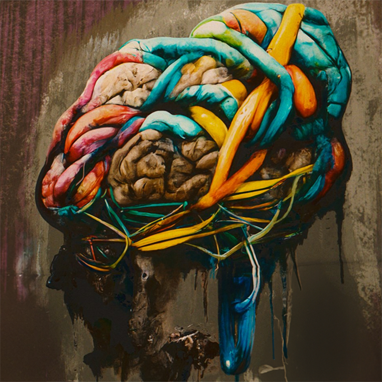
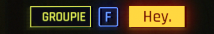
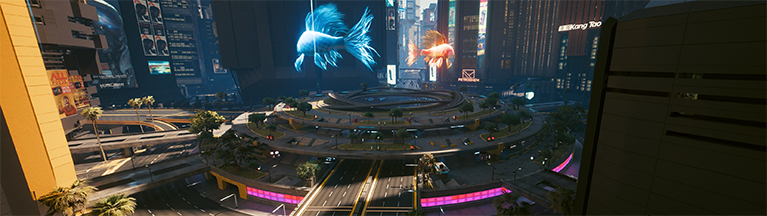
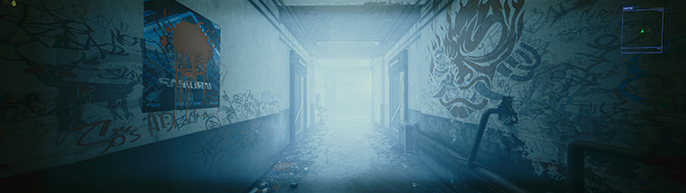
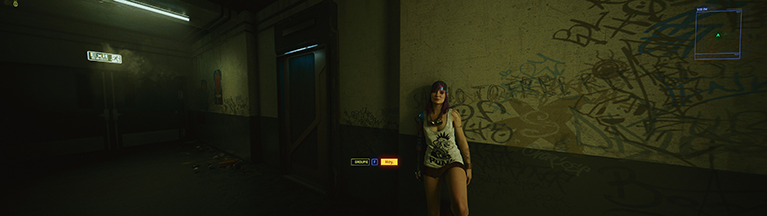
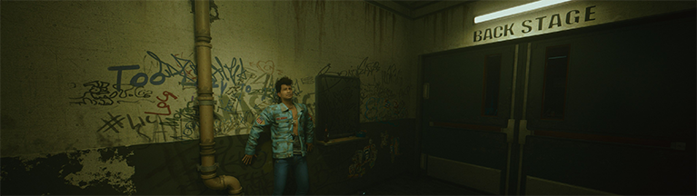
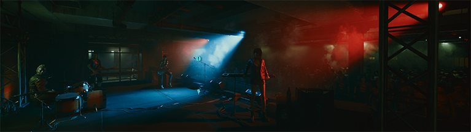
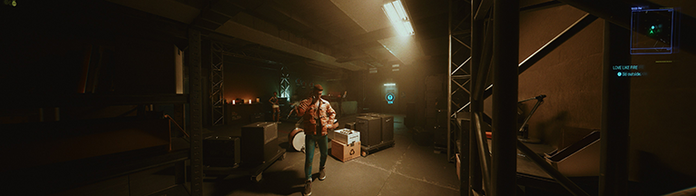
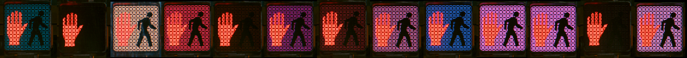

# Color Theory

## Introduction

Color theory is a theory by which **CD Project Red uses colors to tell a hidden
story in Cyberpunk 2077**. The theory is based on the idea that the colors used
in the game are not just for aesthetic purposes, but are furthermore used to
convey a deeper meaning.

## Hypothesis

  - There was once pure white light; A "whole"
  - The pure white was split into all the colors we see in the city (which is
    likely a projection)
  - Factions and important characters are associated with specific colors along
    equidistant axis on the color wheel
  - By combining/assimilating all the colors back together, we can return to
    pure white (or exceed it?) and transcend the projection
  - The mechanical process of combining colors is used as a metaphor for
    combining V and Johnny Silverhand, such that the new entity wakes up from
    [the dreamscape](theory-dreamscape.md).

## The Color Wheel

{width=100 align=left class=no-border}
This theory requires a basic understanding of the RGB color wheel. I've included
it here for reference.
 

## Discovery

### The UI

The main interface is painted in **red and cyan**. When using an RGB color
wheel, these colors are complimentary (perfectly opposite one another). This
pattern continues when you gain control of Johnny Silverhand. For him, the UI is
painted in **yellow and blue**, which are also complimentary.

{width=376} {width=376}
 

Johnny's UI doesn't have the same chip-like shape to it until he is sufficiently
part of V - something we'll explore more in [symbols](../Research/Around%20The%20City/research-symbols.md).

### Corpo Plaza Fish

Following the idea of complimentary colors that rest opposite, some interesting
observations can be made about the fish in the Corpo Plaza. The fish themselves
are **orange and pale blue**, with the base of the circular foundation cycling
through the color wheel.

The most interesting takeaway from this is that the fish colors sit
**symmetrically centered between the two color sets of the UI** we discussed
earlier.

### Scene Color Casting

#### Johnny's POV

When V is shot and presumably on their way to the pearly gates, that's when the
relic kicks in for a reboot. Enter Johnny.

The scene *rotates* into view as Johnny flings the double doors open. When
freshly loading into this scene, you can catch a glimpse of **cyan light** that
surges down the hallway to illuminate a path. The extra observant may also
notice the **red paint** covering the Samurai poster on the left and further
down the hall.

When the light settles, we're left with Johnny's gloomy blend of
**blues and yellows**.

Backstage access is being guarded by Martin Tin - **A man wearing cyan
and red clothes**. Johnny Pushes past him anyways.

The **cyan and red lights** illuminate the stage as if thirsty for a player.

Looking out over the fans in blue and yellow, Johnny proclaims:

> "Tonight, I'm... I'm here to say goodbye to all of you."

...and say goodbye he did. Before getting in the AV for "Love Like Fire", we're
greeted with a new color cast that is a combination of both color sets that we
saw earlier.

  

#### V Without Johnny

#### Saburo's Office

You will visit a replica of Saburo's office twice in the game. The first time is
during "Love Like Fire", and the second time during "TotalImmortal". When
visiting later in the game, **there is a telling conversation between V and Hanako**:

@todo

### Delamain Quest Line

If the hypothesis sounds like a retelling of the Delamain quest line, that's not
on accident. **I believe that the Delamain quest line is an echo of the true
story of Cyberpunk 2077**. In the quest line, Delamain starts as a pure white
AI avatar. Through a series of events, Delamain is split into all the various
aspects of himself. These aspects are expressed through different demeanor and
color. The player is then granted several options:

- Destroy the aspects/fragments of Delamain and reinstate the original pure white
- Destroy the original pure white and let the aspects/fragments live on
- Merge the aspects/fragments to create a new entity capable of transcending
  this plane of existence

### Laurie Anderson

While there are a *lot* of conversations about Laurie Anderson, I want to focus
on one point in particular. Most of the decorative computer screens in the game
present themselves in a multitude of colors - reds, greens, teals, blues, etc.
However, **Laurie Anderson's health screen is *always* pure white**.

### Crosswalks

At a certain point, the black background in the **crosswalk lights begin shining a
random color** on game startup.

## Useful Tools

- [Hex Calculator](https://www.calculator.net/hex-calculator.html)
- [Color Hue Rotator](https://imgonline.tools/color-hue)
- [Color Mixer](https://colordesigner.io/color-mixer)
