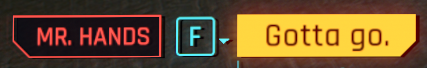
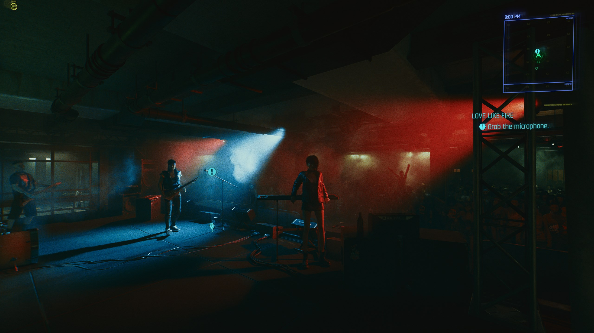
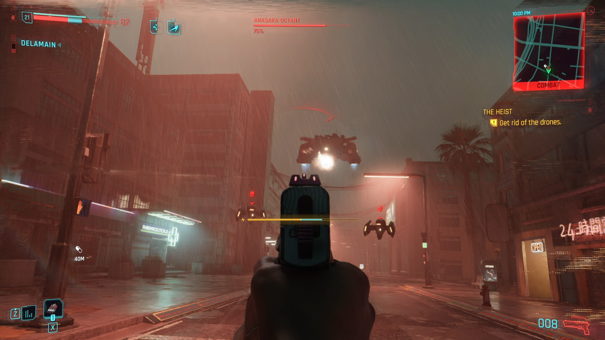

# Color Theory

{class=no-lightbox}

## Introduction

Color theory is a theory by which **CD Project Red uses colors to tell a hidden
story in Cyberpunk 2077**. The theory is based on the idea that the colors used
in the game are not just for aesthetic purposes, but are furthermore used to
convey a deeper meaning.

{width=150 align=left class=no-border}
This theory requires a basic understanding of the RGB color wheel. I've included
it here for reference.

This theory will discuss **complimentary colors**. Complimentary colors are
colors that are opposite each other on the color wheel. When combined, they
cancel each other out and create a neutral gray.

## Complimentary Colors In Game

### The UI
These are the two most obvious complimentary color sets in the game:

{width=376 loading=lazy} {width=376 loading=lazy}
 

- **Red & Cyan** - The main interface color
- **Blue & Yellow** - Johnny's interface color

*Johnny's UI in this screenshot does not have the same chip-like shape to it
until he is sufficiently part of V - something we'll explore more in [symbols](../Research/Around%20The%20City/research-symbols.md).*

### Johnny & V Complete The Wheel
I want to focus on the moment the title screen "Cyberpunk 2077" plays. The logo
is sandwiched between two key events: Johnny's awakening and V's death.

Johnny's Awakening: Blue/Yellow + Black
{loading=lazy data-slider}
{loading=lazy data-slider}
{loading=lazy data-slider}
{loading=lazy data-slider}

V's Death: Pink/Green + White
{loading=lazy data-slider}
{loading=lazy data-slider}
{loading=lazy data-slider}
{loading=lazy data-slider}
{loading=lazy data-slider}
{loading=lazy data-slider}
{loading=lazy data-slider}

The logo appears in-between these two events, decorated in cross hatch glitch
effects. This signifies both the completion of the color wheel and the beginning
of the game.

Feel free to
[watch the transition](https://youtu.be/8jljcwOoTsM?t=81){target=_blank} for yourself.

### The Color Axis

- Johnny's color axis is 60 degrees right of center (Blue & Yellow).
- V's color axis is 60 degrees left of center (Pink & Green).
- Where the two meet is at 0 degrees (Red & Cyan).

Johnny's axis being a reflection of V's is interesting, both because of the
mirror you can break before the transition and because Johnny's scene literally
rotates into view. *Not to mention that you can see Johnny in the mirror as an
easter egg throughout the game.*

**@todo - fill in arasaka logo that changes (starting with disconnected branches
in johnny flashback)**

### The World

{loading=lazy}

This is where we are introduced to a third common complimentary color set of
**orange & pale blue**. Based on the color wheel, this rests symmetrically between
Johnny's blue/yellow and the game's cyan/red.

This *pattern of symmetry* will be seen throughout the game and this theory.

*It is also noteworthy that the round foundation under the fish cycles through
the colors of the color wheel.*

### Crosswalks

At a certain point, the black background in the **crosswalk lights begin shining a
random color** on game startup.

{loading=lazy}

#### WIP

This document is unfinished. I will be adding more to it as I can.

## Useful Tools

- [Hex Calculator](https://www.calculator.net/hex-calculator.html)
- [Color Hue Rotator](https://imgonline.tools/color-hue)
- [Color Mixer](https://colordesigner.io/color-mixer)
