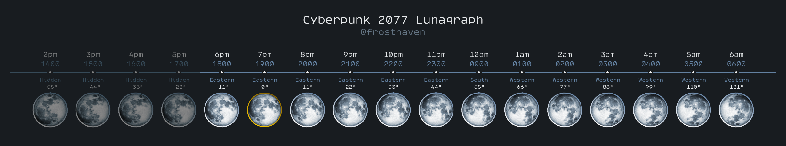

# Lunagraph

## Deducing Time By The Moon's Rotation

This chart was made by tracking the moon's position and rotation in the sky
against the HUD clock. It can determine the time of day when other methods are
unreliable. This is useful when investigating
[Mystery Moon](../Research/Around%20The%20City/mystery-moon.md).

