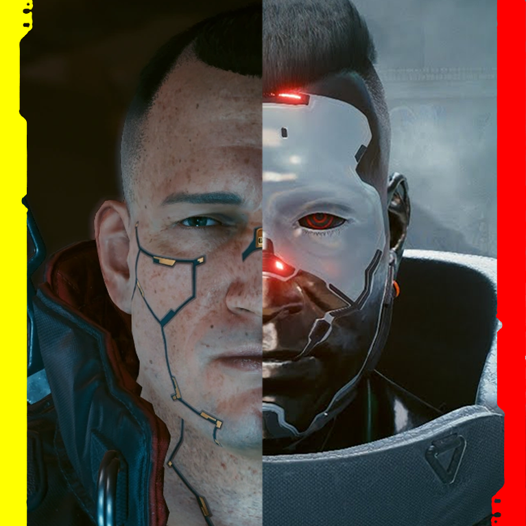

# Working Theory

{class=no-lightbox}

## Warning: This Is A Living Document

This is a _working theory_ and should not be taken as outright fact. It is based
on a collection of observations and interpretations that are subject to change.
These observations can be browsed by viewing my [research](Research/Around%20The%20City/alt-cyberspace-mapping.md) pages.

## Foreword

I've been doing a lot of thinking over the years of how we're accessing
memories and these memories are mixed between Johnny and V. I've often posited
that if the memories were mixed - it wasn't JUST Johnny's memories that would
be false but V's as well.

Konpeki - Does it even exist? It stands as a symbol - two towers individually
connected via bridges. Much the same way V and Johnny overlap. You go up one
tower and are forced to go down the other - mirroring the timeline of the game
going through V's time into Johnny's playing in reverse.

With my thinking on Peter Horvath (demonstrated to be going backwards and
humming backwards in the previous post), what other bleed over memory rewrites
could exist?

We know Johnny didn't go to the top of Arasaka tower. But someone did. That's
someone's memory. Blackhand has been all but ruled out. What about Shaitan?

The facial structure and all-but-obvious faceplate cyberware isn't the only
striking thing about these two:

During "Love Like Fire", Shaitan gets shot and falls during aircraft fire.

During "The Heist", Jackie gets shot and falls during aircraft fire.

Smasher used Shaitan's biopod to lure Blackhand into the duel, but the rules of
the scene were clear - no matter what, Shaitain's biopod miraculously survives.
He later finds himself awake on a boat full of cyberware and goes through his
own cyberpsychosis. Vowing to make Arasaka pay.

I wonder if Jackie could be a ghost of the digital brain - a way of making
sense of Johnny's and V's memories crashing into each other. This idea of being
a digital ghost is echoed in Death's Stranding, where Jackie communicates
through the digital wires and talks about finding his way back home to V.

## What is the City?

The city is a simulation. Its original purpose was to merge Shaitan and Johnny
(a task that succeeded). Aftewards, we the player breach into the system of
memories left behind.

The memories between the active parties all blend together to create new and
interesting twists. Johnny's memory of unplugging Alt bleeds over to create
the scene of V unplugging Evelyn Parker. Everything is based in fact, but with
the premise so twisted that it is hard to recognize.

## Who or What is V?

V is the character who's perspective we create to parse through the overlapping
memories of Johnny and Shaitan. V comes with their own payload of memories,
creating a 3-way hybrid of Johnny, Shaitan and V.

V's data is what was left behind after the merger of Shaitan & Johnny. The
Delamain 21 like child, new to the world and its secrets.

## What is the Statue?

The statue is a projected memory of the interface used to connect to the
simulation. Echoes of a time past, with a reminder that V is not whole.

## What is the cube?

The cube is a manifestation of S.Y.S. An ever changing shape of the system. It
is the progressive nature of the city and of the dream. It is the fine
structure constant of _this_ reality. The smallest divisible unit that
comprises the dreamscape and the shape of the world.

A square in 3 dimensions that can point in any direction along a sphere. The
source code of the dream itself. Always moving, always changing, always the
same.

A glimpse at the cube is a glimpse at the levers of the dream. A way to see the
world for what it truly is. What levers does it move by? That is the key.

## Hypothetical Sequence of Events

### Enter Shaitan

Smasher ripped Shatan's body limb from limb down to his biopod. A painful
experience. He then used the biopod to taunt Blackhand into a duel.

Shaitan's biopod was recovered from the events of the 2023 Arasaka raid, likely
by Militech. With the goal of creating the perfect anti-Arasaka weapon, they
wanted to merge the two people who hated Arasaka the most: Johnny Silverhand &
Shaitan.

Shaitan used this time in solitude to learn surgery and complete his own
transplant of one of the full-body-conversion kits onboard the ship. He
practiced close-quarters combat (including android-only techniques) so that
Smasher would never fell him again.

And so the simulation was made. Plugging Shaitan into the soulkiller-like
system, they merged Shaitan's memories with Johnny's. During his coma, the
memories began overlapping each other. He lost sight of himself and suffered
cyberpsychosis as a result. A complete fracturing of the mind.

Little reminders remaind, however. The patterns in the walls resembling his
arm. The face of his nemesis reflecting his own likeness back. He himself
projected onto new Characters - like Jackie Welles. A friend in troubled times
to help get him home.

He found his way out of Cyberpsychosis, and headed to Japan to start his
personal mission against Saburo and Arasaka.

### Enter V

After Shaitan merged with Johnny, the excess data spilled over the memory banks
of the system. The AI-powered simulation wasn't done just yet. An unknown
netrunner breached this system of memories, leveraging the buffer overflow to
create a new entity from their own memories. From the ashes of 2 fallen titans
and an unknown player, the child V was born. New to the world and its secrets,
the fool began their journey.

The journey won't be so simple for V, who is incompatible at a fundamental
level. While Shaitan and Johnny sat as mirrors `FF0000` (red) and `0000FF` (blue),
V was born into the world as `FF06B5`. The world is full of dangerous memory
overlaps and clues to the past. For V to survive, a new way must be found. The
clock is ticking, though, as the system is unstable. Every corrupted memory a
new land mine waiting to overheat the whole thing.

## Fact Sheet Reference

- It isn't until after we fight Smasher that we gain access to the Ebunike - a
  cargo ship containing full body conversion and military-grade equipment.
  Throughout the game we find random medical peripherals as junk items.

- After fighting smasher and being reduced to his biopod, Shaitan awakens on a
  cargo ship full of advanced Militech gear, including a full body conversion
  kit. He teaches himself surgery and takes on the faceplate from this kit.

- One connective questline runs through all three acts - "Beat on the Brat".
  This questline has us getting better with close quarters combat. When we beat
  the game we're given Gorilla arms (cybernetic body) and a Militech Berzerk (red
  vision).

- When Shaitan finds himself on the cargo ship, he studies all manner of close
  quarters combat so that he doesn't fall to the likes of smasher again. He borgs
  up with Militech gear, including the addition of some red eyes if the 2077
  model is to be believed.

- In the Badlands we find "Dancing On Mines". Dakota mentions that the stranded
  vessel could be part of a "vision quest". There is a car stranded in the midst
  of mines.

- The cargo ship Shaitan wakes up on is surrounded by atonomous mines.

- There's a child drawing that shows a car between an RV and robots. Underneath
  the car is a boat with glowing red and cyan trim.

- When exploring Ghost Tunnel, you'll find graffiti of the Erzulie Loa.
  Normally this particular LOA depicts a mother holding her child - but the child
  is missing even though the mother's arms are still cradling.

- Shaitan uses the memory of his mother while on the boat to get him through
  it.

- Jackie shares this connection to his own mother.

- In fact, if you convince Misty to go to the event, you'll find that Mama
  Wells is quite ready to be everyone's mother once you get past the ice breaker.

- Shaitan experiences his own cyberpsychosis while on that boat, and intends to
  attack Saburo in a very personal way.

- We see Shaitan's cybernetic arm texture in windows. We see it in walls. It's
  painting corners of Arasaka's tower interior. Etched in like a fuzzy memory
  that you can't quite remember nor shake.

- During "Love Like Fire" we don't understand why Shaitan is firing so slow.
  It's out of character and out of place. He ends up taking a bullet.

- We use the very same style mounted gun later when heading to the Kang Tao
  crash, first slowly to test aim and later we can't shoot because it jams,
  leading to someone taking a bullet.

- At the center of the cube in the devil ending where we solve it, we find the
  Devil card. Shaitan translates to "devil" or "deceiver".

- "Beelzebub's (Devil's) Tales to His Grandson" shard can be found on Misty's
  rooftop and with the Zen Master. It talks about their arrival in Babylon and
  the construction of the Tower of Babel.

- The Tower of Babel was a construction intended to pierce the heavens, but the
  creator saw this and cursed everyone with different languages so that they
  could not communicate nor reach Heaven.

- This resonates with the fractured memories of Night City.

- When at low health, we see a ghostly overlay of glitching numbers, as if one
  of our eyes is looking into a screen or ocuset. Shaitan has one of these.

- If taking Rogue through the ending, Squama sends us off with a "Good luck,
  Silverman". This could just be a play on words for Silverhand, but it could
  also be that what he sees before him is a silver man.

- The eclipsing opposite of silver would be gold - the color of the staff at
  Konpeki plaza.

- Lizzie mirrors the story of full body silver-skinned conversion, complete
  with cyberpsychosis waiting on the other side.

- Many of the Tyger Claws wear Oni-style masks which are very reminiscent of
  Shaitan's faceplate.

- Shaitan's real name is Saeed Jalabi.

- S.J. is the mirror of J.S.

- Shaitan's face profile is very similar to Adam Smasher's in "Love Like Fire".
  I can't help but wonder if it is because Shaitan is his own worst enemy and
  sees in himself something dark.

- Despite V being less experienced than Jackie, Jackie can't pilot the flathead
  due to "older firmware".

- If Shaitan/Jackie/V do overlap, then the mental construct of Jackie must be
  laid to rest for the original to surface.

## Lingering Questions

- Are all parties accounted for? Or are there even more memories mixed in all of
  this besides the player's, Johnny's, and Shaitan's?
