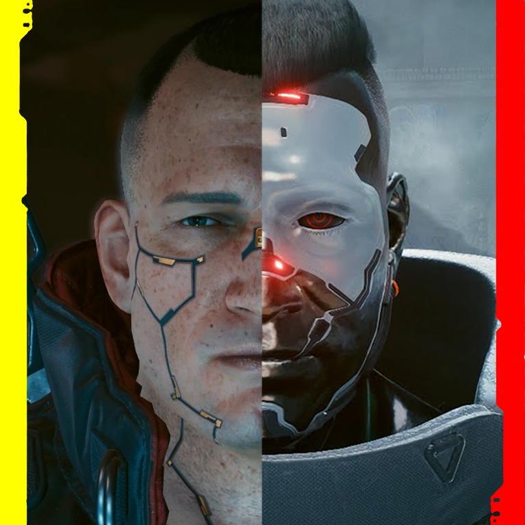

# Working Theory

{class=no-lightbox}

## Warning: This Is A Living Document

_Last updated: 2025-07-26_

This is a _working theory_ and should not be taken as outright fact. It is
based on a collection of observations and interpretations that are subject to
change. These observations can be browsed by viewing my
[research](./Research/Around%20The%20City/alt-cyberspace-mapping.md) pages.

As a result of this being a living document, it's worth noting that findings
held within the research pages may not be fully updated with the present
moment's contexts. Treat them as snapshots in time that led here, and not as
the final word on the matter.

---

### Tower Raid

Johnny was cleaved in two by Smasher. Spider Murphy put the data slug/chip into
Johnny's body in an attempt to extract his engram with an altered version of
soulkiller. It was damaged. The engramatic transfer either could not complete as
a result, or it was completed as much as it could be. Either way, the data
wasn't in a usable state.

### Time of the Game

We, the player, breach into the memory system. It's presented to us in game
form. It isn't a game - but rather the memory store of Johnny Silverhand and the
data slug/chip. His inner psyche and all of the broken memories held within.
Johnny remains in a form of stasis.

We create V as a way to build up the missing memory sectors in Johnny's engram
and navigate the corrupted data. We start by editing our V's own backstory to
fill the gaps. The memories within the engram begin blending with our synthetic
edits to the engramatic data.

From our perspective, we see through the eyes of the synthetic memory we created
and experience the passing of time as if its real - but it isn't. There is no
time. It's all just data. No future. No tomorrow. Only the here and now.

Further complicating this experience, the blending of Johnny's engramatic data
and our synthetic V causes side effects. The memories start to blend. From V's
perspective, they slotted Johnny into their head. It's quite literally the
other way 'round. It's the data slug that was chipped into Johnny. As a player,
it's hard to know where Johnny's memories end and V's begin - and that means its
working.

### A Matter of Perspective

The world we experience is an amalgamation of Johnny's psyche, previous
iterations, and the projection of the data chip. The time is wrong. The colors
are wrong. The memories are wrong. Progressing through the game, we restore
power to several areas. We connect and create neural pathways that were severed.
We collect "hidden gem" scattered bytes of memory data and trudge through
corrupted data. We force Johnny to confront himself and his shadow in the
process.

Scrubbing forward and backwards through them, and looping into every possible
memory - every outcome - we continue to rebuild the engram. Our V goes through
cycles of death and rebirth as we continue along the path. Every iteration fills
more gaps in the world of Johnny's engram data. Every iteration of V recycles
leftover data back into the system - facilitated and buffered through the data
chip's Soulkiller guardian who wear's Alt's face.

### Why Have a Player at all?

The data chip inserted into Johnny was damaged. Likely the ground pins. Between
the incomplete data and the voltage overflowing into the pins, there isn't much
to "soulkill" into the chip intended for Johnny's psyche.

It requires the human element to be the scalpel. To navigate the insanity of a
projected dystopian city being flooded with interference and feedback loops. The
software knows this, and recognizes the player as the necessary human element
when looking at V. The element needed when automation has run out of road.

### Judgement

We eventually reach a point that Johnny's engram is completely patched. No
longer a patient etherized upon the table. No more half deserted streets.

V might have been the dreamer, but it was always Johnny's dream. Johnny's body.
This newly refurbished engram isn't quite Johnny, and it isn't quite V. It's a
third thing comprised of the sum total of the two. An engramatic canvas - this
time with two faces.

### Not as simple as "It was all a dream"

In terms of software, these memories really played out. They happened. When
Johnny awakens, it won't just be him - it'll be him and V in a single entity.
And the history they shared in that place is as real as you or I. After all,
what is a soul?
